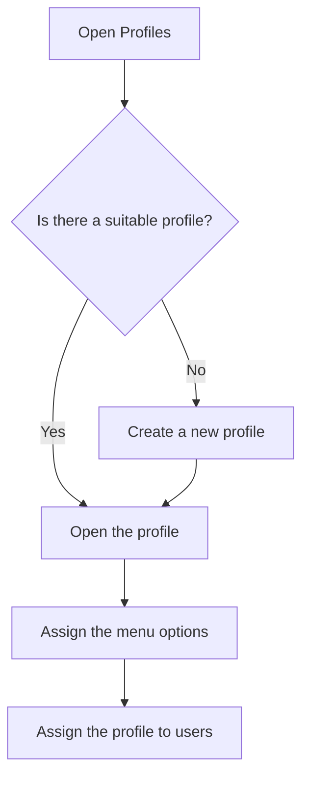

# Profiles

## What this screen is for

A profile is the set of menu options that a group of users sees, for example "Office" or "Shop floor". Here you look up, create and delete profiles; the options of each profile are assigned on its record. Then, in "User management", each user is given a profile. This screen is reserved for administrators.

## Available actions

- Look up profiles with the "Name", "Description" and "System" columns. The "Name" column can be sorted.
- Create a new profile with the green "+" button (tooltip "Create new").
- Open a profile by clicking its row, to change its details or its assigned menus.
- Delete a profile with the delete button on its row. The application asks for confirmation: "Delete profile?".

## Usual flow

1. Check the list to see whether a suitable profile already exists.
2. If there is none, click the "+" button, enter the name and description and save it.
3. Open the profile and tick the menu options it should see.
4. Go to "User management" and assign the profile to the relevant users.

## Important notes

- Profiles marked in the "System" column cannot be deleted: their row has no delete button.
- Deleting a profile removes it permanently, together with its menu assignment.
- Profile names must be unique.
- The profile only decides which options appear in the side menu. A user without a profile sees no options in the menu.

## Common errors

- If you cannot delete a profile, first check that it is not a system profile and that no user has it assigned. Change the profile of those users in "User management" first.
- If a warning about an existing name appears when creating a profile, choose a name that no other profile uses.

## Basic process

