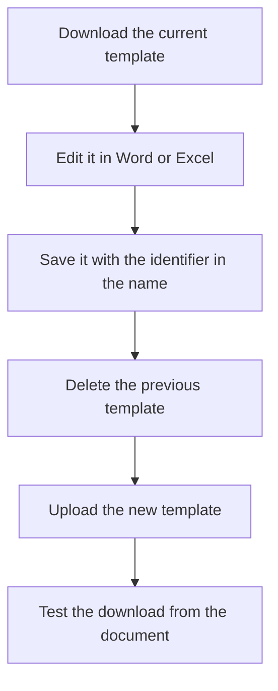

# Reports manager

## What this screen is for

This is where the Word and Excel templates live that the application uses to generate downloadable documents: quotations, sales orders, delivery notes, sales invoices, purchase orders and work orders. When you choose the Word or Excel download option on one of those documents, the application looks here for the template that matches the document and fills it with its data. PDFs do not use these templates.

## Available actions

- Upload a template with the up-arrow button on the right of the "Reports" bar.
- Download a template with the download button on its card, to review or edit it.
- Delete a template with the cross button on its card. The application asks for confirmation: "Are you sure you want to delete the selected file?".
- View an image or a PDF with the eye button. Word and Excel templates have no preview: they can only be downloaded or deleted.

## Usual flow

1. Download the current template of the document you want to change, for example the sales invoice one.
2. Make your changes in Word or Excel and save it with a name that contains the document identifier, for example `SalesInvoice.docx`.
3. Delete the previous template for that document.
4. Upload the new template with the up-arrow button.
5. Open a sales invoice, choose "Download" and check that the document comes out with the new layout.

## Important notes

- The application recognizes each template by its file name. The name must contain one of these identifiers, written exactly like this (upper and lower case included):
  - `Budget`: quotation, "Download" option.
  - `SalesOrder`: sales order, "Download" and "Download without price" options.
  - `DeliveryNote`: delivery note, "Download" and "Download without price" options.
  - `SalesInvoice`: sales invoice, "Download" option, and the download button in "Sales invoice accounting".
  - `PurchaseOrder`: purchase order, "Download" option.
  - `WorkOrder`: work order, "Download Excel" option.
- Sales and purchase documents download as Word files; the work order downloads as an Excel file.
- If more than one file has the same identifier, the application uses only one of them. Keep a single template per document.
- Deleting a template removes it permanently. From then on, the Word or Excel download of that document stops working until you upload another one.
- The "Print PDF" and "Download PDF" options do not depend on this screen. The logo, colors and watermark of PDFs are set up in "Branding".
- The card shows only the first 20 characters of the file name.

## Common errors

- If choosing "Download" on a document downloads nothing or shows an error, first check that there is a template here whose name contains that document's identifier, with the same capitalization.
- If the document comes out with an old layout, check that there are not two templates with the same identifier and delete the extra one.
- If "Error uploading file" appears when uploading a template, try again and check that the file is not empty.
- If "Error deleting file" appears, reopen the screen and check whether the template is still there before trying again.

## Basic process

