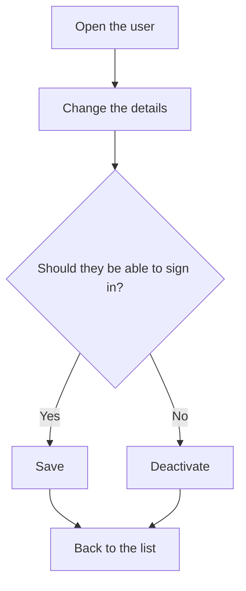

# User

## What this screen is for

This is the record of a user. Here you change the role, profile, first name, last name and language, and activate or deactivate the user's access to the application. On your own record you can also change your password. This screen is reserved for administrators.

## Available actions

- Change the "Role", "Profile", "First name", "Last name" and "Language" and save them with "Save" in the header.
- Deactivate the user with "Deactivate", in the drop-down of the "Save" button, so they cannot sign in. If they are already deactivated, the option is "Activate".
- Change your password with "Change password", in the same drop-down. It only appears on the record of the user you are signed in as.

## Usual flow

1. Open the user from "User management".
2. Change whatever is needed, for example the "Profile".
3. Click "Save". The application saves the changes and returns to the previous screen.
4. If the user should no longer sign in, open the drop-down of "Save" and choose "Deactivate".

## Important notes

- The "Username" cannot be changed.
- "First name" and "Last name" are required, up to 250 characters each.
- "Activate" and "Deactivate" also save the rest of the form changes, and only apply if the form is valid.
- A deactivated user cannot sign in. Users are not deleted: they are deactivated.
- The "Profile" decides which options the user sees in the side menu. The field only appears if profiles exist in "Profiles".
- If you change the "Language" on your own record, the application switches language immediately. For another user, the new language applies when they next sign in.
- Profile changes show up when the user reloads the page or signs in again; role changes, when they sign in again.
- To change the password, enter the "Current password", the new "Password" (at least 5 characters) and repeat it. Confirm with "Update".
- You cannot change the password of another user from this screen.

## Common errors

- If "Error updating password" appears when changing the password, first check that the "Current password" is correct.
- If "Update" does nothing, check the field messages: the new password must be at least 5 characters long and both entries must match.
- If the user says they cannot sign in, check that they are not deactivated (in the list, "Disabled" column).
- If the user does not see the expected menu options, check their "Profile" and the menus assigned to that profile in "Profiles".

## Basic process

