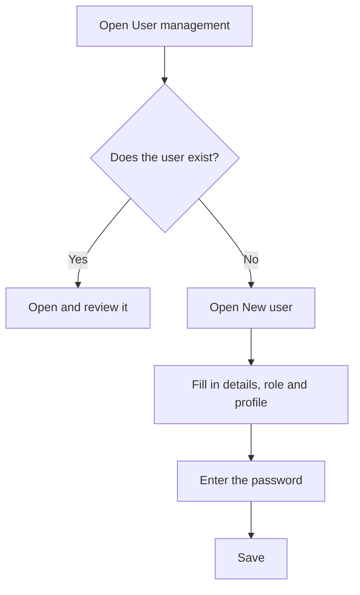

# User management

## What this screen is for

Here you look up the users who can sign in to the application and create new ones. Each user has a role, a language and, normally, a profile, which decides which options they see in the side menu. Profiles are set up in "Profiles". This screen is reserved for administrators.

## Available actions

- Look up users with the "Username", "First name", "Last name", "Profile" and "Disabled" columns. All columns can be sorted.
- Create a user with the green "+" button (tooltip "Create new"), which opens the "New user" dialog.
- Open a user by clicking its row, to change their details or profile, or to activate or deactivate them.

## Usual flow

1. Check in the list that the user does not already exist.
2. Click the "+" button to open "New user".
3. Fill in "Username", "First name", "Last name", "Email", "Role" and "Language".
4. Choose the "Profile" with the menu options they should see.
5. Enter the "Password" and type it again in "Repeat password".
6. Click "Save". The user appears in the list and can sign in straight away.

## Important notes

- Username, first name, last name, email, role, language and password are required. The password must be at least 5 characters long.
- Usernames must be unique and, once the user is created, the username cannot be changed.
- The "Profile" is optional when creating the user, but a user without a profile sees no options in the side menu.
- Users are created active. The "Disabled" column shows the users who cannot sign in.
- Users are not deleted: if someone should no longer sign in, open them and deactivate them.
- The "Language" is the one the application uses for the user when they sign in.

## Common errors

- If saving reports that the username is not available, a user with that name already exists: choose another one or open the existing user.
- If "Passwords do not match" appears, type exactly the same password in both fields.
- If "Email format is invalid" appears, check that the address follows the name@domain format.
- If a new user signs in but sees no menu options, open them and assign a profile that has menus assigned.

## Basic process

