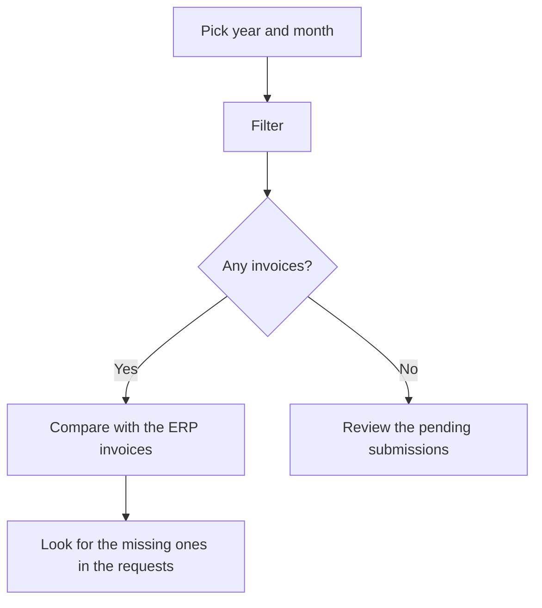

# Verifactu - Sent invoice lookup

## What this screen is for

It asks the AEAT directly which invoices are registered in Verifactu for a given month. It does not show ERP data but what the AEAT has on record. Use it to compare the submissions made from "Invoice Integration to Verifactu" and "Verifactu Integration Requests" with what is actually registered at the Spanish Tax Agency.

## Available actions

- Pick the "Year" (from 2024 up to the current year) and the "Month".
- Run the lookup with the "Filter" button (funnel icon).
- Clear the filter and empty the list with "Clear".
- Sort by any column by clicking its header.
- See the full hash by hovering over the "Hash" column.

## Usual flow

1. Open the screen: the filter suggests the current month or the last month you looked up.
2. Pick the "Year" and "Month" you want to check.
3. Click "Filter" and wait for the AEAT answer.
4. Review the list: number, issue date, type, amounts, registration date and hash.
5. Compare it with the month's invoices in the ERP and, if any is missing, look for it in "Verifactu Integration Requests".

## Important notes

- The lookup does not run by itself when the screen opens: you must click "Filter".
- The lookup uses the "Company tax ID" of the active site ("Site management" screen) and the name of the active company ("Company management" screen).
- It searches for invoices whose issue date falls within the selected month.
- The "Type" column shows the AEAT code: ordinary invoices are sent as "F1" and corrective invoices as "R1".
- The "Registration date" is the date and time when the ERP generated the record it sent.
- The last year and month you looked up are saved as the filter for next time.
- This screen only looks up data: it does not send, fix or cancel anything.

## Common errors

- If you see "Incomplete filter", pick the year and the month before clicking "Filter".
- If you see "No results", the AEAT has no invoice registered for that month under the site's tax ID. Check that the invoices were sent from "Invoice Integration to Verifactu" and that the site's "Company tax ID" is correct.
- If you see "Error searching invoices", the lookup at the AEAT failed. Try again later and, if it persists, ask an administrator to check the Verifactu connection and certificate.
- If a sent invoice is missing, look for it in "Verifactu Integration Requests": if its request shows "Error", the AEAT did not register it and it must be fixed and resent.

## Basic process

