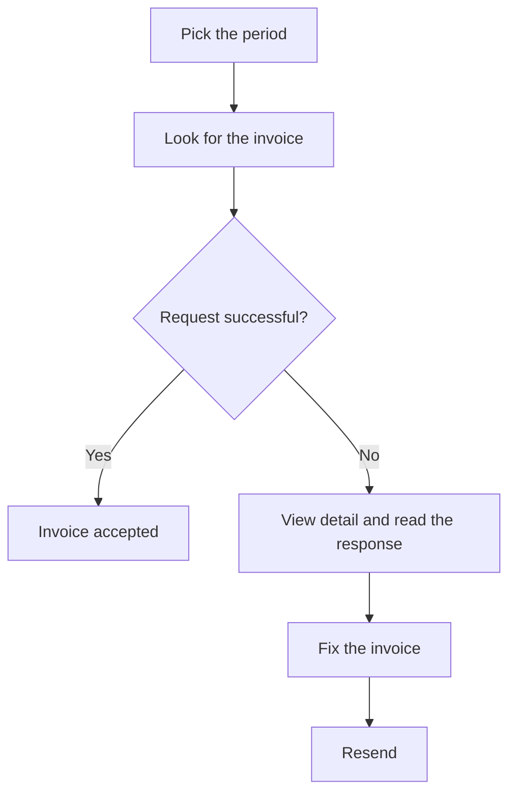

# Verifactu Integration Requests

## What this screen is for

This is the history of every submission of sales invoices to Verifactu. Each time an invoice is sent, successfully or not, a request is stored with what was sent to the AEAT, what it answered and the QR code. Use it to check whether an invoice is registered as accepted, understand why it was rejected, and resend it once fixed. Invoices are sent from "Invoice Integration to Verifactu".

## Available actions

- Pick the "Period" to list the requests made between two dates. The list reloads by itself when both dates are valid.
- Filter by invoice number or customer with "Search".
- Copy the full "Request" or "Response" with the copy button in each cell.
- Open the AEAT validation page by clicking the "QR" image.
- See the full request and response with "View detail" (eye icon).
- Resend a rejected invoice with "Resend" (refresh icon), which only appears on rows with an error.
- Reset the filters with "Clear".

## Usual flow

1. Open the screen: the requests of the last seven days are listed.
2. Look for the invoice by number or customer.
3. Check the "Success" column: "Success" means the AEAT accepted it; "Error" means it was rejected.
4. If there is an error, open "View detail" and read the "Response" to find the reason.
5. Fix the invoice (for example, the customer fiscal data).
6. Come back here, click "Resend" on the failed row and confirm with "Accept".

## Important notes

- An invoice can have several requests: one per attempt. All the requests of any invoice with at least one request inside the period are listed, even if some attempts are older.
- The "Status" column shows the status returned by the AEAT: "Correcto", "AceptadoConErrores" or "Incorrecto". The first two count as accepted.
- "Resend" makes a new submission and adds a new request; it does not change the previous ones. The invoice's Verifactu status becomes "OK" or "Error" depending on the answer.
- An invoice that already has a successful request cannot be resent, even if the button appears on an old failed row of that invoice.
- A resend is chained to the last accepted record, just like a normal submission from "Invoice Integration to Verifactu".
- This screen does not delete or cancel anything: it only reviews and resends.
- The invoice document prints the QR code of the last successful request.

## Common errors

- If resending shows "Invoice has already been integrated with Verifactu", the invoice already has a successful request: find it in the list, nothing else is needed.
- If the "Response" points to an error in the customer tax ID or name, fix it on the invoice's "Fiscal data" tab (only shown while the Verifactu status is "Pendent" or "Error") and then resend.
- If the resend fails again for the same reason, read the code and description in the error message: they come straight from the AEAT and tell you which data must be fixed.
- If you do not see the requests of the last day of the period, move the end date one day later.
- If the list does not load, check that both dates of the "Period" are picked and that the start date is not after the end date.
- If the invoice was answered with "AceptadoConErrores", it counts as accepted: review the "Response" to see the AEAT warnings.

## Basic process

