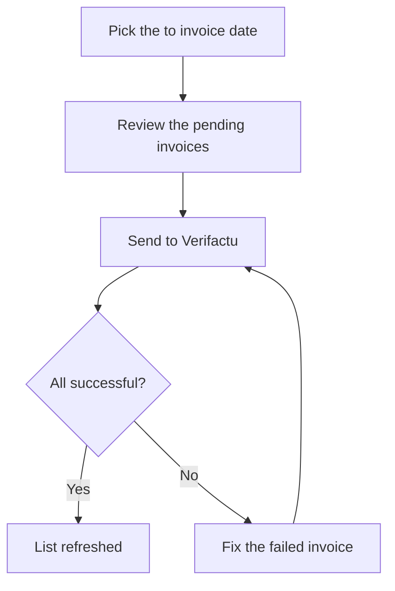

# Invoice Integration to Verifactu

## What this screen is for

This is where sales invoices that are not yet registered with the Spanish Tax Agency (AEAT) are sent to it through Verifactu. It is the last step of the sales flow: `sales order -> delivery note -> invoice -> send to Verifactu`. Sending is not automatic: invoices do not reach Verifactu until someone sends them from here or resends them from "Verifactu Integration Requests".

## Available actions

- Pick the "To invoice date" to list the pending invoices dated up to and including that day. The list reloads by itself when the date changes.
- Reset the filter with "Clear": the date goes back to today.
- Send every invoice in the list with "Send to Verifactu". The number on the button shows how many invoices will be sent.
- Open an invoice by clicking its number.
- In the result dialog, expand the AEAT response of a failed invoice with "Show details".

## Usual flow

1. Open the screen: the pending invoices up to today are listed.
2. If you only want to send up to a specific date, change the "To invoice date".
3. Review the list (number, date, due date, customer with their tax ID, and amount).
4. Click "Send to Verifactu" and wait for the progress bar to finish. The dialog cannot be closed while sending.
5. Review the summary of "successful" and "errors" and close the dialog with "Close". The list reloads and the accepted invoices disappear from it.
6. If an invoice failed, fix it (see the errors below) and send it again.

## Important notes

- The list shows the invoices whose Verifactu status is the initial one (usually "Pendent") or "Error". That is why rejected invoices come back to the list so they can be retried.
- Invoices get the initial status of the "Verifactu" lifecycle when they are created, corrective invoices included. Invoices without a Verifactu status never appear in this list.
- Invoices are sent one at a time in invoice number order. Each record is chained to the last record accepted by the AEAT and carries a hash calculated from the previous one; the very first record is marked as the start of the chain.
- Sending stops at the first invoice that fails, to keep the chain in order. The later invoices stay pending and remain in the list.
- An invoice counts as accepted when the AEAT answers "Correcto" or "AceptadoConErrores". The invoice's Verifactu status then becomes "OK"; with any other answer it becomes "Error".
- Every attempt, successful or not, is recorded with the request sent, the response and the QR code. You can review them in "Verifactu Integration Requests".
- Corrective invoices are sent as corrective invoices and reference the original invoice.
- Once an invoice has been accepted, it cannot be sent again and its customer fiscal data is locked. The invoice document prints the QR code of the last accepted submission.
- The issuer data sent is the "Company tax ID" of the invoice's site and the company name (the "Site management" and "Company management" screens).

## Common errors

- If the result shows "Incorrecto" with a message containing a code and a description, the AEAT rejected the invoice. Read the description and, if needed, open "Show details" to see the full response.
- If the rejection is about the customer data (tax ID or legal name), open the invoice and fix it on the "Fiscal data" tab, which is only shown while the Verifactu status is "Pendent" or "Error". When saving you can apply the fix to the other pending or failed invoices of the same customer; the customer record is updated too. Then send it again.
- If you see "Invoice has no details. Cannot send to Verifactu", add lines to the invoice before sending it.
- If you see "Enterprise not found to send invoice to Verifactu", check that there is an active company in "Company".
- If you see "Invoice has already been integrated with Verifactu", the invoice is already accepted: check it in "Verifactu Integration Requests" and do not send it again.
- If sending stops with a timeout or an unexpected error, check "Verifactu Integration Requests" before retrying: the request may have reached the AEAT anyway. If the error repeats for every invoice, ask an administrator to check the Verifactu connection and certificate.
- If the list is always empty, check in "Lifecycles" that the "Verifactu" lifecycle exists and has an initial status.
- If an invoice answered with "AceptadoConErrores" was taken as accepted, review its response in "Verifactu Integration Requests" to see the AEAT warnings.

## Basic process

