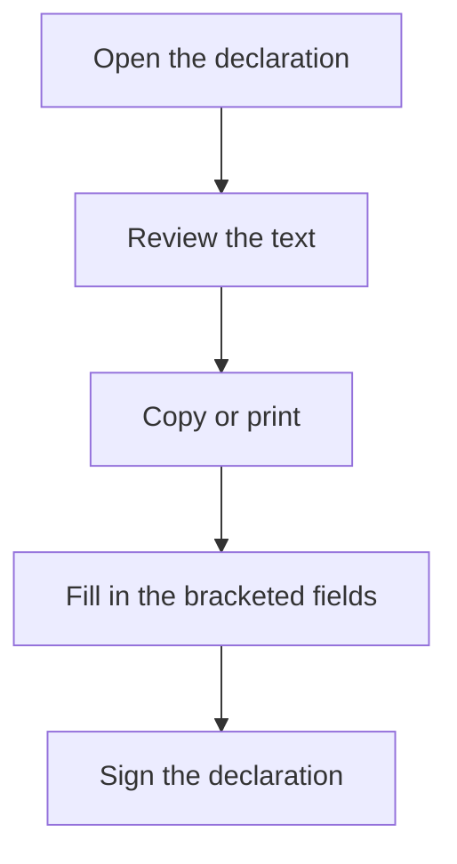

# Responsible declaration of Veri\*Factu system implementation

## What this screen is for

It shows the template text of the responsible declaration about the invoicing system and Veri\*Factu. It is a reference document: nothing is configured, saved or sent to the AEAT here. Use it as the basis for drafting the declaration that the company responsible for the software must sign.

## Available actions

- Read the text of the declaration.
- Print it from the browser (for example, with Ctrl+P): the screen has a print-friendly layout.

## Usual flow

1. Open the screen.
2. Read the text and spot the fields in square brackets, for example [COMPANY NAME], [CIF] or [Software Name].
3. Copy the text into the document where you want to complete it.
4. Fill in the bracketed fields with the real data and have the responsible person sign it.

## Important notes

- The bracketed fields are placeholders: the application does not fill them with the company or site data.
- The text is fixed and shown in the application language. It cannot be edited here.
- The declaration lists commitments of the software (integrity of the records, hash and chaining, submission to the AEAT, retention and unique identification). The screen only displays them; it does not check anything.
- Actual submissions to Verifactu are made in "Invoice Integration to Verifactu" and reviewed in "Verifactu Integration Requests".

## Common errors

- If the printed document shows [city], [date] or [CIF] literally, they were not filled in: the screen does not replace those fields. Complete them in the document you are going to sign.
- If you cannot find this screen in the menu, it may not have been added: an administrator can add it to the menu.
- If you need the text in another language, change the application language and open the screen again.

## Basic process

