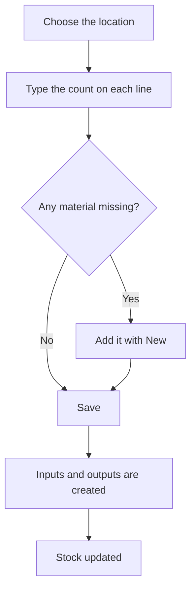

# Inventory

## What this screen is for

Use it to bring system stock in line with the physical count. Each line shows a reference in a location, with its lot and dimensions, the units the system holds ("Units") and a "Count" box where you type what you counted. When you press "Save", the system creates an input or an output for each difference; they then appear in "Warehouse movements" and update "Stock".

## Available actions

- Filter by "Location" and search by "Reference". The list is filtered instantly.
- Remove the filters with "Clear".
- Type the real count in each line's "Count" column.
- Add a stock line that is not in the list with the "New" (+) button: choose the "Material", "Location", lot, "Quantity" and, if needed, the dimensions.
- Apply all changes with "Save".

## Usual flow

1. Choose the "Location" you want to count.
2. For each line, type what you counted in "Count". Leave it unchanged if it matches.
3. If you find material that is not in the list, add it with "New" (+).
4. Press "Save".
5. Check for the "Inventory created successfully" message. The list reloads with the new stock.

## Important notes

- Nothing is stored until you press "Save". If you leave the screen before that, the counts you typed are lost.
- "Save" applies the changes of every modified line, including lines the filter is hiding at that moment.
- For each modified line: if the count is higher than "Units", an "Input" is created with the description "Entrada per inventari"; if it is lower, an "Output" with the description "Sortida per inventari". A count of 0 empties the line.
- The movement uses the same location, lot and dimensions as the line.
- Lines added with "New" (+) show "Units" as 0 and are saved as an input when you press "Save". If their dimensions do not exactly match an existing stock line, a separate stock line is created.
- In the "New" dialog, the lot can only be chosen after the material. You can pick an open lot, or type a new code and choose the "Crear lot "..."" option. The new lot is created at that moment, even if you then cancel the dialog.
- If the count leaves a lot at zero across all locations, the lot closes automatically and can no longer receive inputs.
- Only lines with positive units in active warehouses, locations and references are shown. Service references have no stock.

## Common errors

- If "Error creating inventory movement" appears on save with "The lot is already closed and cannot be reopened", the line is adding units to a closed lot: use an open lot or create a new one with "New" (+).
- If "No default location defined in the project" appears on save, choose the "Default location" of the active warehouse in "Warehouse management".
- If an error appears on save, reopen the screen and check the stock before saving again: the lines that did save have already been applied and would be applied again.
- If the "New" dialog does not save, check the warnings: "Reference is required", "Location is required" or "Quantity must be at least 1".
- If a reference is missing from the list, first check whether its stock is zero (add it with "New" (+)) or whether it is in a disabled warehouse or location.

## Basic process

