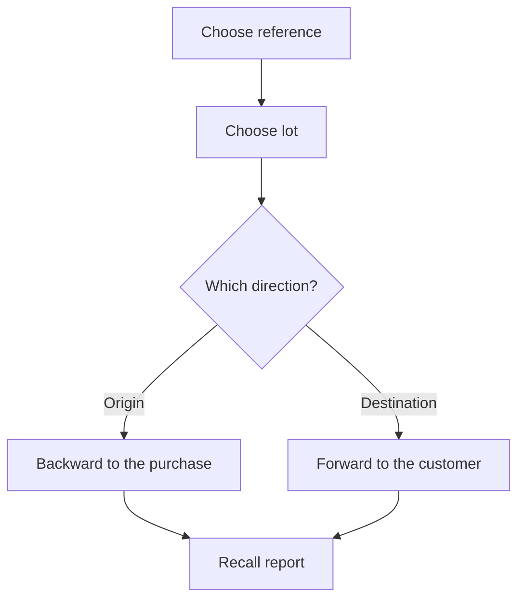

# Lot traceability

## What this screen is for

Lets you follow a lot along the chain `purchase receipt -> consumption at the machine -> work order production -> sales delivery note`. You choose a reference and a lot and see, as a tree, which material lots it comes from (backward) or which produced lots and customers it has reached (forward). When there is a quality issue, the "Recall report" tells you which customers, delivery notes and units are affected. It is a read-only screen: it changes nothing.

## Available actions

- Choose the "Reference" and then the "Lot". Traceability loads when you choose the lot.
- Check the "Backward (from a sold lot)" tab: the material lots consumed to make the lot, level by level, down to the lots that came in through a purchase receipt.
- Check the "Forward (from a purchased lot)" tab: the lots produced with this material, level by level, up to the final product.
- Expand each lot in the tree with the arrow to see its related lots and its movements.
- Generate the "Recall report" with the button of the same name. It appears below the tabs.
- Reach the screen with the reference and lot already selected from the "View lot traceability" icon in "Stock", in "Warehouse movements" or on the lines of a receipt delivery note.

## Usual flow

1. Choose the "Reference" of the affected product or material.
2. Choose the "Lot" in the dropdown.
3. In "Backward", expand the tree to see which material lots it comes from and, on the movement rows, the supplier and the receipt delivery note.
4. Switch to "Forward" to see which produced lots it went into and, on the movement rows, the customers and the sales delivery notes.
5. Press "Recall report" to get the affected delivery notes by customer, with the total of delivery notes and units.

## Important notes

- Only references marked "Requires lot" have lots. Lots are created automatically: on a receipt delivery note line, when the work order is created (the produced lot takes the work order code or the code entered when creating it, depending on configuration), on a sales delivery note without a lot, and in the "New" dialog of "Inventory".
- The link between a material lot and the produced lot comes from the consumption recorded when the phase is completed at the machine. Without that consumption, the tree cannot go any further.
- Backward, the tree stops at lots that came in through a purchase receipt. The tree reaches at most 10 levels.
- In the "Quantity" column, the first row shows what is left of the lot; rows for other lots show the quantity consumed; and movement rows show the movement quantity, negative for outputs and consumption.
- Movement rows show the type tag, the location, the supplier or customer and the description. "Date" only appears on these rows. Supply transfers to machines are not shown.
- The "Lot" dropdown only offers open lots. A lot closes on its own when its stock reaches zero across all locations and never reopens, so a lot that has been fully consumed or sold cannot be chosen here.
- The "Recall report" is based on forward traceability: it gathers the sales delivery notes of the final lots the lot has reached (or of the lot itself, if it has not been used to make anything), grouped by customer, with "N affected delivery notes" and "N affected units". If the lot was consumed in a work order, the report does not count direct sales of the lot itself.

## Common errors

- If the "Lot" dropdown is disabled, choose the "Reference" first.
- If the lot you are looking for is not in the dropdown, first check whether it is already closed (zero stock) or whether the reference does not have "Requires lot".
- If you arrive from a traceability icon and no lot is selected, the lot is already closed.
- If the "Lot not found" warning appears, the lot no longer exists: choose the reference again.
- If the backward tree only shows the selected lot, check that material consumption was recorded when the work order phase was completed and that the material had a lot.
- If the report says "This lot has not reached any customers.", no sales delivery note carries this lot or the lots produced from it yet.

## Basic process

