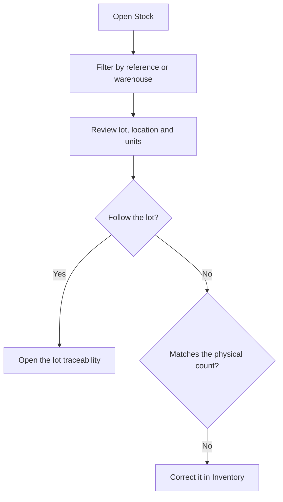

# Stock

## What this screen is for

Shows current stock: how many units there are of each reference, in which warehouse and location, from which lot and with which dimensions. It is a read-only screen: stock only changes through movements, which are generated by purchase receipts, sales delivery notes, supply and consumption at machines, work order production and "Inventory". The history of those movements is in "Warehouse movements".

## Available actions

- Filter by "Warehouse" and by "Reference". The list is filtered instantly.
- Remove the filters with "Clear".
- Sort by the "Reference" column.
- Open the lot traceability of a row with the "View lot traceability" icon. "Lot traceability" opens with the reference and lot already selected.
- Save the column and filter setup as a view, to get it back next time.

## Usual flow

1. Open "Stock".
2. Choose the "Reference" you want to check and, if needed, the "Warehouse".
3. Review each row: "Lot", "Warehouse", "Location", "Units" and dimensions.
4. If you need to follow a lot, press the row's traceability icon.
5. If the stock does not match the physical count, correct it in "Inventory".

## Important notes

- Each row is a combination of reference, location, lot and dimensions ("Width (x) mm", "Length (y) mm", "Height (z) mm", "Diameter (mm)", "Thickness (mm)"). The same reference can appear in several rows if it has different lots, locations or dimensions.
- Only rows with positive units are shown. When a row reaches zero, it disappears.
- Stock in disabled warehouses, locations or references is not shown.
- Service references never have stock.
- The "Reference" dropdown only offers references that have stock.
- The "Closed" tag next to a lot means the lot is already closed. A lot closes on its own when its total stock reaches zero and can no longer receive inputs.
- The traceability icon is disabled when the row has no lot.
- Automatic inputs (receipts, production, delivery note returns) go to the "Default location" of the active warehouse, set in "Warehouse management".

## Common errors

- If a reference does not appear, first check that it is not a service, that its stock is not zero and that the warehouse, location or reference is not disabled.
- If a receipt has not been added to stock, check that the receipt delivery note is in the "Recepcionat" status: until then it does not create the input.
- If a reference's stock is split into rows you expected together, check their lot and dimensions: any difference creates a separate row.
- If the traceability icon opens the screen with no lot selected, the lot is already closed.

## Basic process

