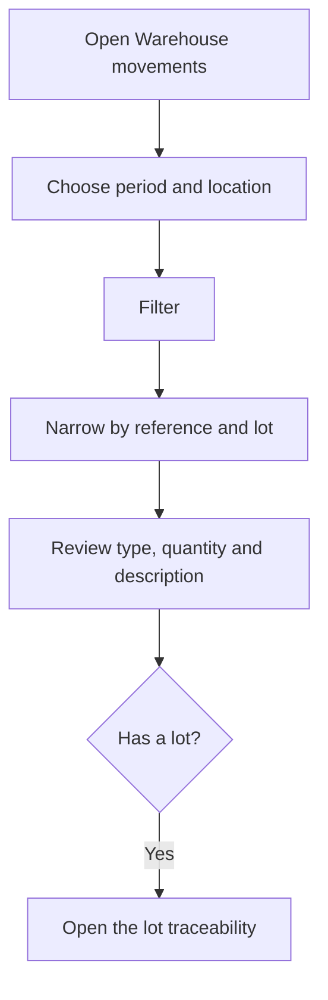

# Warehouse movements

## What this screen is for

This is the history of every stock movement: inputs and outputs, supply and consumption at machines, production and inventory adjustments. Use it to find out why a reference's or a lot's stock is what it is. It is read-only: other screens generate the movements automatically, and the resulting stock is shown in "Stock".

## Available actions

- Choose the "Period" and press "Filter" to load the movements for those dates.
- Limit the load to one "Location" (applied when you press "Filter").
- Narrow the loaded list by "Reference" and by "Lot".
- Remove the filters with "Clear".
- Open a movement's lot traceability with the "View lot traceability" icon.
- Save the column and filter setup as a view, to get it back next time.

## Usual flow

1. Open "Warehouse movements". The "Period" already suggests the dates of the current year's financial year.
2. Adjust the period and, if needed, the "Location", and press "Filter".
3. Choose the "Reference" and, if needed, the "Lot" to keep only the movements you are interested in.
4. Review the "Date", "Movement type", "Quantity" and "Description", which tells you where the movement comes from.
5. If the movement has a lot, open its traceability with the row's icon.

## Important notes

- What generates each movement type:
  - "Input": a purchase receipt when the receipt delivery note moves to the "Recepcionat" status; the return of a sales delivery note that is no longer "Entregat"; an "Inventory" count above the stock.
  - "Output": a sales delivery note when it moves to "Entregat"; an "Inventory" count below the stock.
  - "Input" and "Output" as a pair: supplying material to a machine and returning it. The description reads, for example, "Supply to APR-... WO ...".
  - "Consumption": when a phase is completed at the machine, the supplied material is consumed. Leftover offcuts go back to the default location as a positive "Consumption" ("Residue return to ...").
  - "Production": when the last phase of a work order is completed, the good pieces of the last internal phase enter the default location ("Production WO ...").
- "Quantity" is positive for inputs and negative for outputs and consumption.
- Service references never generate movements.
- If a receipt delivery note leaves "Recepcionat", its input movement is removed from the history and the stock is subtracted. By contrast, if a sales delivery note is no longer "Entregat", a return input movement is created.
- The "Description" is stored in the language of the user who generated the movement.
- Movements cannot be edited or deleted here. To correct stock, use "Inventory".
- The "Reference" and "Lot" filters only work on the movements already loaded; the "Lot" dropdown only offers the lots that appear in them.

## Common errors

- If the "Invalid filter" warning appears with "Select a period", choose both dates of the period before pressing "Filter".
- If the "Period" is empty when the screen opens, there is no financial year named after the current year: choose the dates manually.
- If you cannot find a movement, first check that its date falls within the period and that the filtered "Location" is correct, then press "Filter" again.
- If a receipt's input is missing, check that the receipt delivery note is in "Recepcionat" and that the reference is not a service.
- If the traceability icon does not appear on a movement, the movement has no lot or its lot has no code.

## Basic process

