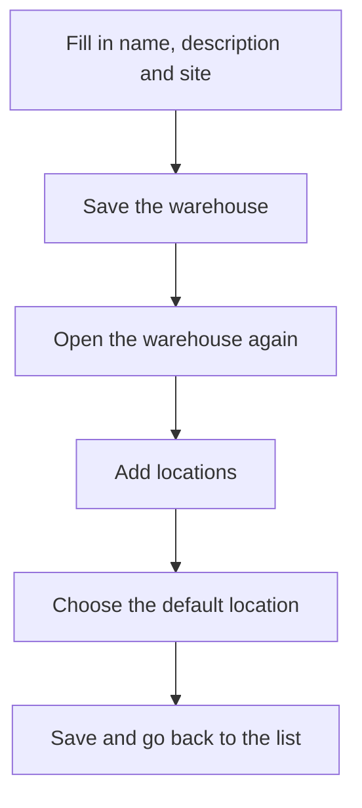

# Warehouse

## What this screen is for

This is a warehouse's record. At the top are the warehouse's data (name, description, site, default location and whether it is disabled) and below it the "Locations" table, where you create and maintain the locations that hold stock. When creating a warehouse, the title is "New warehouse"; when editing one, "Warehouse" followed by its name. The list of all warehouses is in "Warehouse management".

## Available actions

- Edit the "Name", "Description", "Site", "Default location" and the "Disabled" checkbox, and store them with "Save" in the header.
- Add a location with the + button of the "Locations" table. The "Create location" dialog opens.
- Edit a location by clicking its row ("Update location" dialog).
- Delete a location with the row's cross and confirm the "Are you sure you want to delete location...?" message.
- Filter locations by type with the "All types" dropdown.

## Usual flow

1. From "Warehouse management", press "New" (+) to open "New warehouse".
2. Fill in the "Name", "Description" and "Site" and press "Save".
3. Go back to the list and open the new warehouse.
4. Press + in "Locations", fill in the "Name", "Description" and, if needed, the "Type", and press "Save". Repeat for each location.
5. Choose the "Default location" from the locations you created and press "Save" in the header. The screen goes back to the list.

## Important notes

- "Name", "Description" and "Site" are required. The location "Type" is optional: "Supply", "Receiving", "Shipping" or "Storage".
- To save an existing warehouse, a "Default location" must be chosen. A new warehouse has none yet, because locations are added afterwards.
- The "Default location" dropdown only offers this warehouse's locations.
- Locations are saved immediately when you press "Save" in their dialog, without saving the warehouse record.
- The default location is where the system puts automatic inputs and outputs (purchase receipts, sales delivery notes, work order production and offcuts returned from machines). The system takes it from an active warehouse.
- The location that is the warehouse's default location cannot be deleted: choose another one first.
- "APR-" locations named after a machine, of type "Supply", are created by the system when the machine is created. If the machine is disabled or deleted, so is its location, unless it has stock or movements: then it is kept.
- A location or warehouse marked as "Disabled" no longer shows its stock in "Stock" or "Inventory" and is not offered in location dropdowns.
- Deleting a location is permanent, and a location that has stock or warehouse movements cannot be deleted. If it has already been used, mark it as "Disabled" instead.

## Common errors

- If the "Select a default location" warning appears when saving, choose one in the "Default location" field. If the list is empty, create a location first.
- If "Location has dependencies" appears when deleting a location, it is the default location (choose another one, save and try again) or it has stock or movements (mark it as "Disabled").
- If a new location does not appear in the table after saving it, first check that this warehouse has no other location with the same name.
- If a new warehouse is not saved, check that no warehouse with the same name already exists and that the name is no longer than 50 characters.

## Basic process

