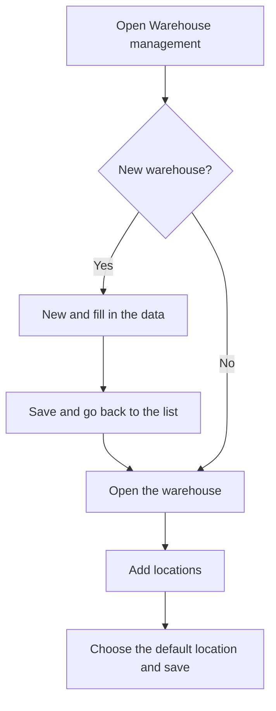

# Warehouse management

## What this screen is for

Lists the company's warehouses. Each warehouse belongs to a site and has locations, which is where the stock of each reference is kept. From here you create a new warehouse, open a warehouse to set up its locations and its default location, or delete one. The stock kept in these warehouses is shown in "Stock", and its history in "Warehouse movements".

## Available actions

- Create a warehouse with the "New" (+) button. The "New warehouse" screen opens.
- Open a warehouse by clicking its row to edit its data and its locations.
- Delete a warehouse with the row's trash icon ("Delete") and confirm the "Are you sure you want to delete warehouse...?" message.
- Check the "Name", the "Description" and whether it is "Disabled".

## Usual flow

1. Press "New" (+) to add a warehouse.
2. Fill in the "Name", "Description" and "Site" and press "Save".
3. Go back to the list and open the warehouse you just created.
4. Add its locations in the "Locations" table.
5. Choose the "Default location" and press "Save".

## Important notes

- The "Default location" is where the system puts automatic inputs and outputs when no other location is given: purchase receipts, sales delivery notes, work order production and offcuts returned from machines. The system takes it from an active (not disabled) warehouse.
- A disabled warehouse still appears in this list, but its stock no longer shows in "Stock" or "Inventory" and its locations are not offered in location dropdowns.
- When a machine is created, the system automatically creates a "Supply" location named "APR-" plus the machine name in an active warehouse. This is where material supplied to the machine goes.
- Deletion is permanent and also deletes the warehouse's locations. A warehouse cannot be deleted if any of its locations has stock or warehouse movements; in that case, mark it as "Disabled".

## Common errors

- If "The warehouse ... could not be deleted" appears, a location has stock or warehouse movements: mark it as "Disabled".
- If a receipt, a delivery note or the end of a work order fails with "No default location defined in the project", open the active warehouse and choose its "Default location".
- If the "Warehouse created successfully" message does not appear after creating a warehouse, first check that no other warehouse has the same name.
- If a warehouse's stock has disappeared from "Stock", check that the warehouse or the location is not marked as "Disabled".

## Basic process

