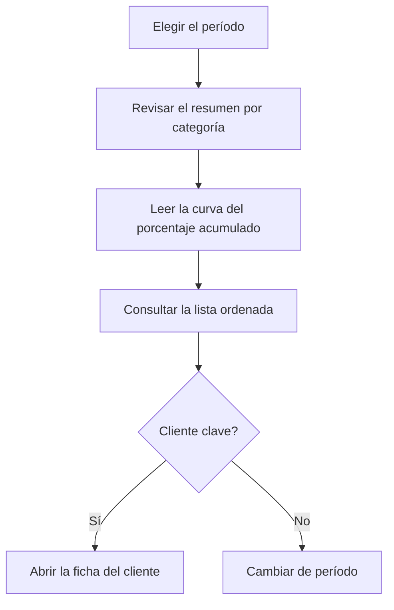

# ABC por cliente

## Para qué sirve esta pantalla

Clasifica a los clientes en tres categorías según el peso de su facturación en un período, con el criterio de Pareto: pocos clientes suelen concentrar la mayor parte de las ventas. Sirve para decidir dónde poner el esfuerzo comercial y de servicio. Se basa en las facturas de venta del período.

## Acciones disponibles

- Elegir el «Período» con el selector de fechas. Filtra por la fecha de la factura.
- Aplicar el filtro con «Filtrar». Cambiar el período también recarga los datos.
- Volver al año en curso con «Limpiar».
- Ver la curva ABC en la pestaña «Gráfico».
- Consultar la clasificación en la pestaña «Datos» y ordenarla por cliente, valor o categoría.
- Abrir la ficha de un cliente haciendo clic en su nombre subrayado.

## Flujo habitual

1. Abre la pantalla: analiza el año en curso.
2. En «Gráfico», lee el resumen superior: cuántos clientes hay en cada categoría y qué parte del valor suponen.
3. Mira dónde la línea de «% acumulado» llega al 80 % y al 95 %: marca dónde terminan los clientes A y B.
4. Abre «Datos» para ver la lista ordenada y la categoría de cada cliente.
5. Haz clic en un cliente para abrir su ficha si quieres revisarlo.

## Aspectos importantes

- **«Valor»**: suma del total de las facturas de venta del cliente con fecha dentro del período, con impuestos y transporte. Las facturas desactivadas no cuentan y las rectificativas restan.
- Los clientes con valor cero o negativo en el período no aparecen en el análisis.
- **«Posición»**: orden del cliente de mayor a menor valor.
- **«% valor»**: peso del cliente sobre el total de todos los clientes del análisis.
- **«% acumulado»**: suma del «% valor» de este cliente y de todos los que tiene por encima.
- **«Categoría»**, según el «% acumulado» de la fila:
  - **A** (rojo): hasta el 80 %. Son los clientes principales.
  - **B** (naranja): de más del 80 % hasta el 95 %.
  - **C** (verde): el resto, por encima del 95 %.
- El % acumulado incluye al propio cliente. Por eso, si un solo cliente supera el 80 % del total, queda clasificado como B, no como A.
- **Resumen del gráfico**: para cada categoría muestra el número de clientes y su porcentaje sobre el total de clientes, y el valor y su porcentaje sobre el valor total.
- **Gráfico**: las barras son el «Valor» de cada cliente, con el color de su categoría, y se leen en el eje izquierdo. La línea azul es el «% acumulado», en el eje derecho de 0 a 100. Con más de 40 clientes se ocultan los nombres del eje horizontal; pasa el ratón por encima de una barra para verlos.
- El «Código» y el nombre salen de los datos del cliente que constan en las facturas.
- La pantalla solo consulta: no cambia ningún dato del cliente.
- Para los proveedores existe el análisis equivalente, «ABC por proveedor».

## Errores frecuentes

- Si un cliente no aparece, comprueba que tenga facturas de venta no desactivadas dentro del período y que su total no sea cero o negativo.
- Si el gráfico muestra «No hay datos para mostrar», el período no tiene ninguna factura de venta.
- Si los datos no cambian después de elegir una fecha, comprueba que el período tenga también la fecha final.
- Si el valor de un cliente es más bajo de lo esperado, revisa si tiene facturas rectificativas en el período.

## Proceso básico

