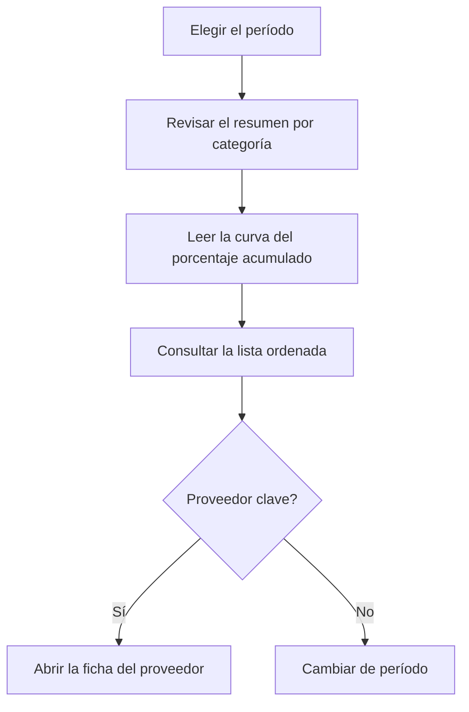

# ABC por proveedor

## Para qué sirve esta pantalla

Clasifica a los proveedores en tres categorías según el peso de las compras que se les han hecho en un período, con el criterio de Pareto: pocos proveedores suelen concentrar la mayor parte del gasto de compra. Sirve para decidir con qué proveedores negociar condiciones o vigilar la dependencia. Se basa en las facturas de compra del período.

## Acciones disponibles

- Elegir el «Período» con el selector de fechas. Filtra por la fecha de la factura de compra.
- Aplicar el filtro con «Filtrar». Cambiar el período también recarga los datos.
- Volver al año en curso con «Limpiar».
- Ver la curva ABC en la pestaña «Gráfico».
- Consultar la clasificación en la pestaña «Datos» y ordenarla por proveedor, valor o categoría.
- Abrir la ficha de un proveedor haciendo clic en su nombre subrayado.

## Flujo habitual

1. Abre la pantalla: analiza el año en curso.
2. En «Gráfico», lee el resumen superior: cuántos proveedores hay en cada categoría y qué parte del valor suponen.
3. Mira dónde la línea de «% acumulado» llega al 80 % y al 95 %: marca dónde terminan los proveedores A y B.
4. Abre «Datos» para ver la lista ordenada y la categoría de cada proveedor.
5. Haz clic en un proveedor para abrir su ficha si quieres revisarlo.

## Aspectos importantes

- **«Valor»**: suma del total de las facturas de compra del proveedor con fecha de factura dentro del período, con impuestos y con los descuentos aplicados. Las facturas desactivadas no cuentan.
- Solo cuentan las facturas de compra: los gastos de «Gestión de gastos» no aparecen.
- Los proveedores con valor cero o negativo en el período no aparecen en el análisis.
- **«Posición»**: orden del proveedor de mayor a menor valor.
- **«% valor»**: peso del proveedor sobre el total de todos los proveedores del análisis.
- **«% acumulado»**: suma del «% valor» de este proveedor y de todos los que tiene por encima.
- **«Categoría»**, según el «% acumulado» de la fila:
  - **A** (rojo): hasta el 80 %. Son los proveedores principales.
  - **B** (naranja): de más del 80 % hasta el 95 %.
  - **C** (verde): el resto, por encima del 95 %.
- El % acumulado incluye al propio proveedor. Por eso, si un solo proveedor supera el 80 % del total, queda clasificado como B, no como A.
- **Resumen del gráfico**: para cada categoría muestra el número de proveedores y su porcentaje sobre el total de proveedores, y el valor y su porcentaje sobre el valor total.
- **Gráfico**: las barras son el «Valor» de cada proveedor, con el color de su categoría, y se leen en el eje izquierdo. La línea azul es el «% acumulado», en el eje derecho de 0 a 100. Con más de 40 proveedores se ocultan los nombres del eje horizontal; pasa el ratón por encima de una barra para verlos.
- El nombre es el nombre comercial de la ficha del proveedor. La columna «Código» muestra el número de factura del proveedor de una de sus facturas del período, no un código de proveedor.
- La pantalla solo consulta: no cambia ningún dato del proveedor.
- Para los clientes existe el análisis equivalente, «ABC por cliente».

## Errores frecuentes

- Si un proveedor no aparece, comprueba que tenga facturas de compra no desactivadas dentro del período y que su total no sea cero o negativo.
- Si una compra no suma, revisa la fecha de la factura de compra: el período filtra por esa fecha, no por la del albarán ni la del vencimiento.
- Si el gráfico muestra «No hay datos para mostrar», el período no tiene ninguna factura de compra.
- Si los datos no cambian después de elegir una fecha, comprueba que el período tenga también la fecha final.

## Proceso básico

