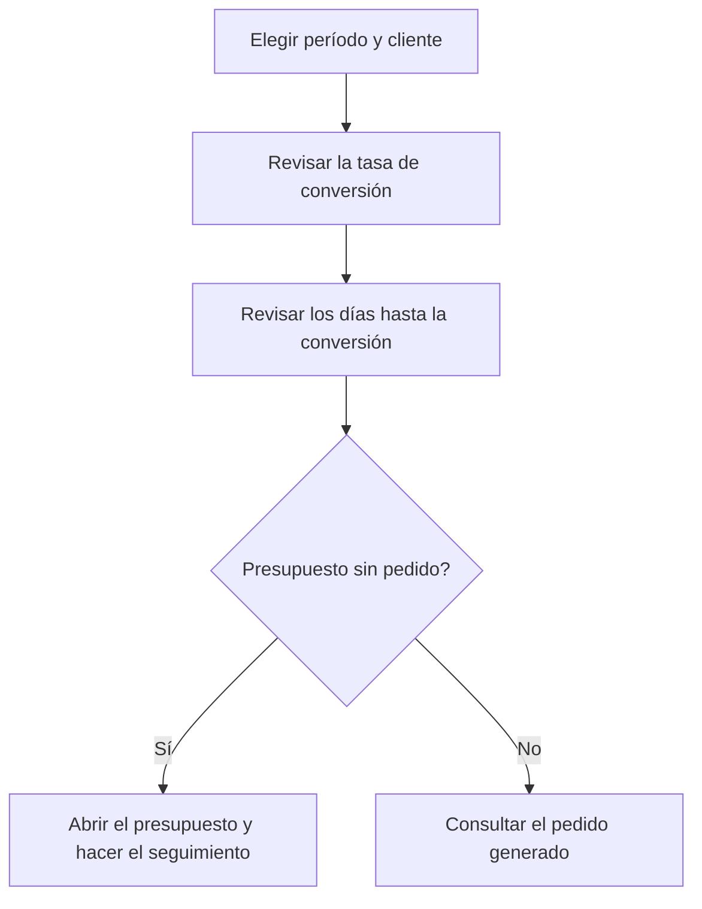

# Conversión de presupuestos

## Para qué sirve esta pantalla

Mide cuántos presupuestos de un período han acabado en pedido, cuánto tiempo ha pasado entre el presupuesto y el pedido y qué importe se ha convertido. Se sitúa al inicio del circuito de venta, `presupuesto -> pedido -> albarán -> factura`: sirve para seguir la eficacia comercial en general o para un cliente concreto.

## Acciones disponibles

- Elegir el «Período» con el selector de fechas. Filtra por la fecha del presupuesto.
- Elegir un «Cliente» para limitar el análisis a sus presupuestos.
- Aplicar el filtro con «Filtrar». Cambiar el período o el cliente también recarga los datos.
- Volver al año en curso y a todos los clientes con «Limpiar».
- Abrir la ficha del cliente, el presupuesto o el pedido haciendo clic en el nombre o en el código subrayado de la fila.
- Ordenar la tabla por cliente, código de presupuesto, estado o código de pedido.

## Flujo habitual

1. Abre la pantalla: muestra los presupuestos del año en curso de todos los clientes.
2. Revisa las tarjetas, sobre todo «Tasa de conversión» y «Tiempo medio aceptación (días)».
3. Elige un «Cliente» si quieres analizar solo uno.
4. En la tabla, busca los presupuestos sin «Código pedido» para hacer su seguimiento.
5. Haz clic en el «Código presupuesto» para abrir el presupuesto y actuar sobre él, o en el «Código pedido» para ver el pedido generado.

## Aspectos importantes

- Entran los presupuestos no desactivados con fecha dentro del período y, si lo has elegido, del cliente indicado.
- **Un presupuesto está convertido cuando tiene un pedido creado desde el presupuesto** con «Crear pedido» y el pedido no está desactivado. El estado del presupuesto no interviene: un presupuesto con pedido cuenta como convertido sea cual sea su estado, y uno marcado como aceptado pero sin pedido no cuenta.
- Si un presupuesto tiene más de un pedido, solo se tiene en cuenta el primero por fecha.
- **«Presupuestos»**: número de presupuestos del período. **«Pedidos»**: cuántos de ellos tienen pedido.
- **«Tasa de conversión»**: «Pedidos» dividido por «Presupuestos», en porcentaje.
- **«Tiempo medio aceptación (días)»**: media de «Días hasta conversión» de los presupuestos convertidos. Los no convertidos no cuentan.
- **«Días hasta conversión»**: días naturales entre la fecha del presupuesto y la fecha del pedido.
- **«Importe presupuestado»**: suma de las líneas de todos los presupuestos del período, sin impuestos.
- **«Importe convertido»**: suma de las líneas actuales de los pedidos generados, sin impuestos. Si después de crear el pedido se han cambiado sus líneas, este importe ya refleja los cambios y puede diferir del presupuestado.
- La columna «Importe» de la tabla es el importe del presupuesto.
- La columna «Estado» muestra el estado del presupuesto según su ciclo de vida.
- La pantalla solo consulta: no modifica ningún presupuesto ni pedido.

## Errores frecuentes

- Si un presupuesto aceptado no aparece como convertido, comprueba que el pedido se haya creado desde el presupuesto con «Crear pedido». Un pedido creado a mano no queda vinculado.
- Si un presupuesto no aparece, revisa su fecha: el período filtra por la fecha del presupuesto, no por la del pedido.
- Si «Importe convertido» supera o no llega a «Importe presupuestado», revisa si las líneas del pedido se han modificado después de crearlo.
- Si la tabla queda vacía, comprueba el cliente elegido y que el período tenga fecha final.

## Proceso básico

