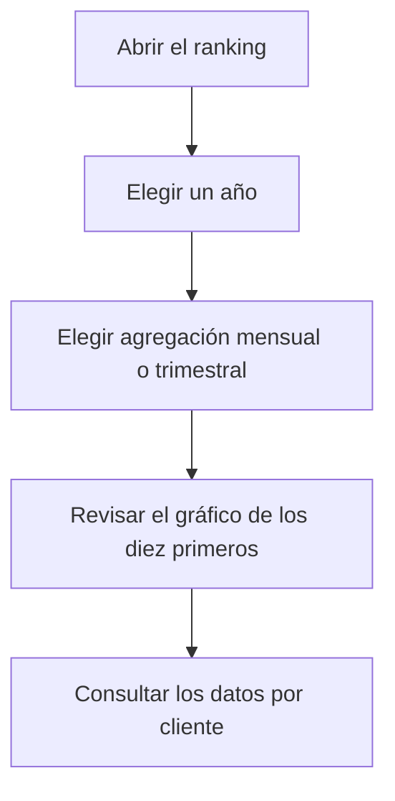

# Ranking de clientes

## Para qué sirve esta pantalla

Muestra cuánto ha facturado cada cliente durante un año natural, ordenado de mayor a menor, y cómo se reparte esa facturación por meses o trimestres. Se basa en las facturas de venta: sirve para identificar a los clientes principales y ver en qué época del año concentran sus compras.

## Acciones disponibles

- Elegir el «Año» en la lista: aparecen el año en curso y los diez anteriores. Al cambiarlo, los datos se vuelven a cargar.
- Elegir la «Agregación»: «Mensual» muestra una columna por mes y «Trimestral», una por trimestre.
- Limpiar el filtro con el botón de limpiar filtros: vuelve al año en curso y a la agregación «Mensual».
- Ver el peso de cada cliente en la pestaña «Gráfico».
- Consultar las cifras por cliente y período en la pestaña «Datos». Todas las columnas se pueden ordenar.

## Flujo habitual

1. Abre la pantalla: muestra el año en curso agrupado por meses.
2. Revisa las tarjetas «Total Facturas» y «Total Ventas».
3. En «Gráfico», mira qué parte de la facturación concentran los diez primeros clientes.
4. Abre «Datos» para ver la facturación de cada cliente mes a mes.
5. Cambia a «Trimestral» para comparar trimestres, o elige otro «Año» para compararlo con el año anterior.

## Aspectos importantes

- Se cuentan las facturas de venta no desactivadas con fecha de factura dentro del año elegido, del 1 de enero al 31 de diciembre. Cuenta la fecha de la factura, no la del vencimiento ni la del albarán.
- El importe de cada factura es su total con impuestos y transporte. Por eso «Total Ventas» no coincide con la «Facturación (acumulado año)» del «Panel de dirección», que cuenta la base sin impuestos.
- Las facturas rectificativas restan del cliente y cuentan como una factura más en «Total Facturas».
- **«Total Facturas»**: número de facturas del año. **«Total Ventas»**: suma de sus importes.
- **Gráfico**: tarta con los diez clientes que más han facturado. El resto se agrupa en una sola porción, «Otros». Pasa el ratón por encima de una porción para ver su importe.
- **Datos**: una fila por cliente, ordenada por «Total» de mayor a menor. Un guion significa que el cliente no tiene facturación en ese mes o trimestre.
- El nombre del cliente es el nombre comercial que consta en la factura.
- La agregación solo cambia cómo se presentan los datos: no vuelve a consultar el servidor.
- La pantalla solo consulta: no modifica ninguna factura.

## Errores frecuentes

- Si un cliente no aparece, comprueba que tenga facturas con fecha dentro del año elegido y que no estén desactivadas.
- Si el importe de un cliente es inferior al esperado, revisa si tiene facturas rectificativas en ese año.
- Si el gráfico muestra «No hay datos para mostrar», el año elegido no tiene ninguna factura de venta.
- Si aparece «Error cargando el ranking de clientes», vuelve a elegir el año. Si persiste, avisa al administrador.

## Proceso básico

