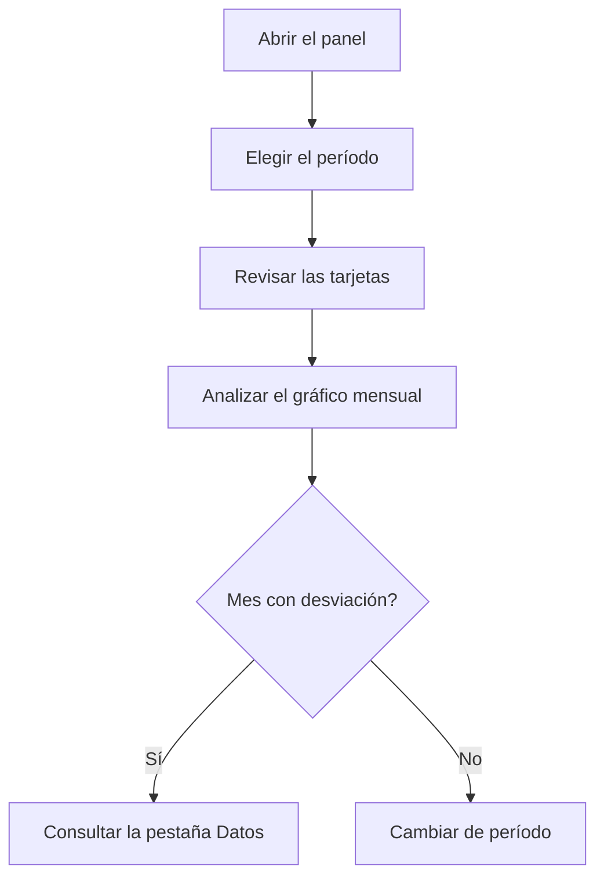

# Panel comparativo de flujo de caja

## Para qué sirve esta pantalla

Compara, mes a mes, los cobros previstos de las facturas de venta con los pagos previstos de las facturas de compra y de los gastos. No es una vista de facturación: cada importe cuenta en el mes de su vencimiento o de su fecha de pago, no en el mes de la factura. Sirve para ver en qué meses entra o sale más dinero y cómo evoluciona el saldo dentro del período elegido.

## Acciones disponibles

- Elegir el «Período» con el selector de fechas. Cuando hay fecha de inicio y de fin, el panel se recalcula solo.
- Limpiar el filtro con el botón de limpiar filtros: vuelve al año en curso, del 1 de enero al 31 de diciembre.
- Ver la evolución en la pestaña «Gráficos».
- Consultar cada movimiento en la pestaña «Datos», ordenable por «Fecha».

## Flujo habitual

1. Abre la pantalla: muestra el año en curso.
2. Revisa las cuatro tarjetas: «Ingresos», «Gastos», «Neto» y «Media mensual neta».
3. En «Gráficos», busca los meses en que la línea de gastos supera a la de ingresos y en que el «Saldo acumulado» baja.
4. Cambia el «Período» para centrarte en unos meses concretos o en otro año.
5. Abre «Datos» para ver qué vencimientos o gastos explican un mes concreto.

## Aspectos importantes

- **«Ingresos»**: suma de los vencimientos de las facturas de venta con fecha de vencimiento dentro del período. El importe es el total de la factura con impuestos, repartido según la forma de pago. Las facturas rectificativas restan.
- **«Gastos»**: suma de dos fuentes dentro del período:
  - los vencimientos de las facturas de compra (total con impuestos), por fecha de vencimiento;
  - los gastos registrados en «Gestión de gastos», por fecha de pago. Los gastos recurrentes aparecen una vez por cada pago generado.
- **«Neto»** es «Ingresos» menos «Gastos». Sale en verde si es positivo y en rojo si es negativo.
- **«Media mensual neta»** es la suma del neto de cada mes dividida por el número de meses que tienen algún movimiento. Los meses sin ningún vencimiento ni gasto no cuentan.
- En el gráfico, «Ingresos» y «Gastos» son el total de cada mes. El «Saldo acumulado» (área gris) suma el neto mes a mes desde el primer mes con movimientos. Empieza en cero: no es el saldo del banco ni incluye lo que había antes del período.
- En «Datos», cada fila es un vencimiento o un gasto. El importe sale en verde si es un ingreso y en rojo si es un pago. Los textos de «Tipo», «Detalle» y «Descripción» se generan automáticamente y no se traducen:
  - venta: tipo «Venta», detalle «Factura», descripción con el número de factura y la fecha de vencimiento;
  - compra: tipo «Compra», detalle con el nombre fiscal del proveedor, descripción con el número de factura del proveedor y la fecha de la factura;
  - gasto: tipo «Despesa», detalle con el tipo de gasto y la descripción del gasto.
- Se cuentan todas las facturas, sea cual sea su estado. Un vencimiento ya cobrado o pagado sigue apareciendo.
- La pantalla solo consulta: no modifica ninguna factura ni gasto.

## Errores frecuentes

- Si una factura de venta no aparece en el mes esperado, revisa sus vencimientos: cuenta la fecha de vencimiento, no la fecha de factura.
- Si el panel no cambia después de elegir una fecha, comprueba que hayas elegido también la fecha final del período.
- Si falta una factura de compra, comprueba que tenga vencimientos. Una factura de compra sin vencimientos no suma ningún gasto.
- Si aparece el mensaje «Error cargando datos del panel», vuelve a elegir el período. Si persiste, avisa al administrador.

## Proceso básico

