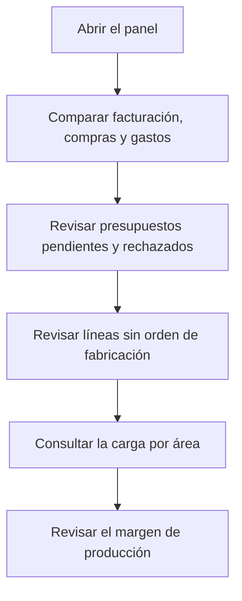

# Panel de dirección

## Para qué sirve esta pantalla

Resume en una sola pantalla el estado del negocio: facturación, compras y gastos del ejercicio comparados con el año anterior, presupuestos pendientes y rechazados, pedidos sin orden de fabricación, evolución de clientes, carga prevista de las máquinas y margen de producción. Está pensada para una revisión rápida de la dirección; para analizar un indicador a fondo, usa el panel específico (por ejemplo, «Conversión de presupuestos» o «Ranking de clientes»).

## Acciones disponibles

- Consultar las tarjetas de indicadores. La pantalla no tiene filtros: todo se calcula sobre el ejercicio en curso, el que incluye la fecha de hoy.
- Pasar el ratón por el gráfico «Horas máquina previstas por área» para ver las horas de cada área y semana.
- Ocultar o mostrar un área del gráfico haciendo clic en su nombre en la leyenda.
- Volver a abrir la pantalla para recalcular los datos.

## Flujo habitual

1. Abre la pantalla al inicio de la semana o del mes.
2. Compara «Facturación (acumulado año)», «Compras» y «Gastos» con el año pasado.
3. Revisa «Presupuestos pendientes» y «Presupuestos rechazados» para hacer el seguimiento comercial.
4. Mira «Líneas de pedido sin orden de fabricación» para detectar pedidos que aún no se han lanzado a producción.
5. Consulta el gráfico de horas para ver qué áreas van cargadas las próximas semanas.
6. Revisa el «Margen coste producción vs facturado» para vigilar la rentabilidad.

## Aspectos importantes

- **Ejercicio en curso**: si ningún ejercicio de «Ejercicios» incluye la fecha de hoy, todas las tarjetas salen a cero.
- **«Facturación (acumulado año)»**: suma de la base sin impuestos de las facturas de venta no desactivadas, desde el inicio del ejercicio hasta hoy. «Mismo período año anterior» es la misma ventana de fechas un año atrás. El porcentaje es la variación: verde si crece, rojo si baja.
- **«Compras»**: base sin impuestos de las facturas de compra no desactivadas, por fecha de factura, con la misma ventana y la misma comparación.
- **«Gastos»**: importe de los gastos de «Gestión de gastos» con fecha de pago dentro de la misma ventana. En compras y gastos, el porcentaje sale en verde si baja y en rojo si sube.
- **«Presupuestos pendientes»**: todos los presupuestos no desactivados en estado «Pendent d'acceptar», de cualquier fecha. «Importe pendiente» es la suma de sus líneas sin impuestos.
- **«Presupuestos rechazados»**: presupuestos en estado «Rebutjat» con fecha dentro del ejercicio en curso.
- **«Líneas de pedido sin orden de fabricación»**: líneas de pedido no servidas y sin orden de fabricación vinculada, de pedidos que no están en estado «Comanda Servida» ni «Comanda Facturada». Cuenta todas las líneas, también las de referencias que no se fabrican.
- **«Clientes nuevos»**: clientes activos dados de alta en los últimos 30 días.
- **«Clientes perdidos»**: clientes que tienen facturas en el ejercicio anterior, completo, y ninguna desde el inicio del ejercicio en curso hasta hoy.
- **«Horas máquina previstas por área»**: horas estimadas de las órdenes de fabricación abiertas, es decir, no cerradas ni canceladas, repartidas por semana de fecha planificada durante las seis semanas a partir de la actual:
  - el eje horizontal muestra el número de semana (S seguido del número);
  - las órdenes con fecha planificada ya pasada se suman a la semana actual;
  - se cuenta el tiempo estimado de todas las fases no externas, sin descontar el trabajo ya hecho; el tiempo de ciclo se multiplica por la cantidad planificada;
  - cada fase se asigna al área de su «Máquina preferida» o, si no tiene, a la de una máquina de su tipo;
  - solo aparecen las áreas activas marcadas como «Visible en planta». El número entre paréntesis de la leyenda es el número de máquinas activas del área.
- **«Margen coste producción vs facturado»**: para las órdenes de fabricación cerradas del ejercicio en curso que ya se han facturado, el porcentaje es (facturado − coste) / facturado:
  - el coste es el coste de máquina, de operario y de material acumulado en cada orden;
  - el facturado es el importe sin impuestos de las líneas de factura que proceden del pedido de la orden, a través del albarán;
  - la primera línea inferior indica cuántas órdenes se han analizado y el coste total dividido por el facturado total.
- **«WIP»**: el mismo cálculo para las órdenes del ejercicio aún no cerradas ni canceladas, comparando el coste acumulado hasta ahora con el importe de las líneas de pedido vinculadas. Una orden sin línea de pedido suma coste pero no ingreso, y hace bajar el margen.
- La pantalla solo consulta: no modifica ningún dato.

## Errores frecuentes

- Si todo sale a cero, comprueba en «Ejercicios» que haya un ejercicio que incluya la fecha de hoy.
- Si «Presupuestos pendientes» o «Presupuestos rechazados» salen a cero y debería haber alguno, revisa que los estados del ciclo de vida de presupuestos se llamen exactamente «Pendent d'acceptar» y «Rebutjat».
- Si un área no aparece en el gráfico de horas, activa «Visible en planta» en «Áreas».
- Si una orden no aparece en las horas de ninguna área, revisa que sus fases tengan «Máquina preferida» o un tipo de máquina con máquinas en áreas visibles.
- Si una orden cerrada no entra en el margen, comprueba que la línea de pedido tenga la orden vinculada y que se haya servido con albarán y facturado.

## Proceso básico

