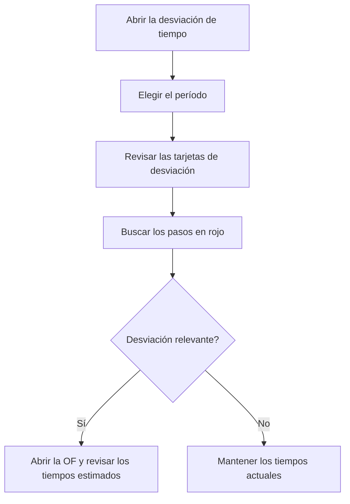

# Desviación de tiempo

## Para qué sirve esta pantalla

Compara el tiempo real de máquina y de operario con el tiempo teórico de las rutas de fabricación, paso a paso. Los datos salen de los tickets de producción del período: para cada paso de una fase (por ejemplo, preparación o producción) muestra cuánto se había previsto, cuánto se ha tardado y la diferencia. Sirve para detectar las fases y las órdenes de fabricación (OF) en las que los tiempos estimados no se ajustan a la realidad.

## Acciones disponibles

- Elegir el «Período». Los datos se vuelven a cargar solos al cambiarlo; el botón «Filtrar» también los recarga.
- Pulsar «Limpiar» para volver al período por defecto, el año en curso completo.
- Ordenar la tabla por «Orden de trabajo», «Fase» o «Estado».
- Abrir una OF haciendo clic en su código en la columna «Orden de trabajo».

## Flujo habitual

1. Abre la pantalla: se carga el año en curso.
2. Mira las tarjetas de arriba: «Desviación máquina» y «Desviación operario» dan la desviación global en porcentaje.
3. Acota el «Período» al mes o la semana que quieres analizar.
4. Busca en la tabla las filas con la desviación en rojo, que son los pasos que han tardado más de lo previsto.
5. Haz clic en la OF para revisar su fase y los tiempos estimados de los pasos.

## Aspectos importantes

- **De dónde salen los datos**: de los tickets de producción con fecha dentro del período. Los tickets se generan solos cuando se finaliza una fase en la máquina de planta, o se crean a mano en «Tickets de producción». Cada fila agrupa todos los tickets del período de un mismo paso.
- **«Estado»**: el estado de máquina del paso (por ejemplo, preparación o producción).
- **«Cantidad»**: piezas declaradas en los tickets del paso. En los tickets automáticos son las piezas buenas.
- **«Teór. máq. (min)»**: tiempo estimado del paso. Si el paso es por tiempo de ciclo, se multiplica por la «Cantidad»; si no, cuenta una sola vez.
- **«Real máq. (min)»**: tiempo de máquina sumado de los tickets.
- **«Teór. op. (min)»** y **«Real op. (min)»**: lo mismo con el tiempo estimado de operario del paso y el tiempo de operario de los tickets.
- **«Desv. máq. (min)»** y **«Desv. op. (min)»**: real menos teórico. En rojo si es positivo (se ha tardado más de lo previsto) y en verde si es cero o negativo.
- **Tarjetas**: «Teórico máquina», «Real máquina», «Teórico operario» y «Real operario» suman los minutos de todas las filas. «Desviación máquina» y «Desviación operario» son la diferencia entre real y teórico en porcentaje sobre el teórico.
- El tiempo hecho en estados de máquina que no son ningún paso de la fase no genera tickets y no aparece aquí.
- La pantalla solo consulta: no modifica ningún ticket ni ninguna ruta.

## Errores frecuentes

- Si la tabla sale vacía, no hay tickets de producción dentro del período: comprueba que las fases se hayan finalizado en la máquina.
- Si faltan los tickets del último día del período, es porque el día final no se incluye: elige como fecha final el día siguiente.
- Si un paso por tiempo de ciclo sale con «Cantidad» 0 y todo el tiempo real como desviación, no se declararon piezas buenas: el tiempo teórico queda a 0.
- Si «Teór. op. (min)» sale a 0, el paso no tiene tiempo estimado de operario en la OF.
- Si un paso con tiempo fijo, como una preparación, tiene tickets en dos períodos, el tiempo teórico completo aparece en cada período: amplía el período para compararlo bien.
- Si la desviación global sale al 0 %, puede que el tiempo teórico total sea 0: revisa que los pasos tengan tiempo estimado.

## Proceso básico

