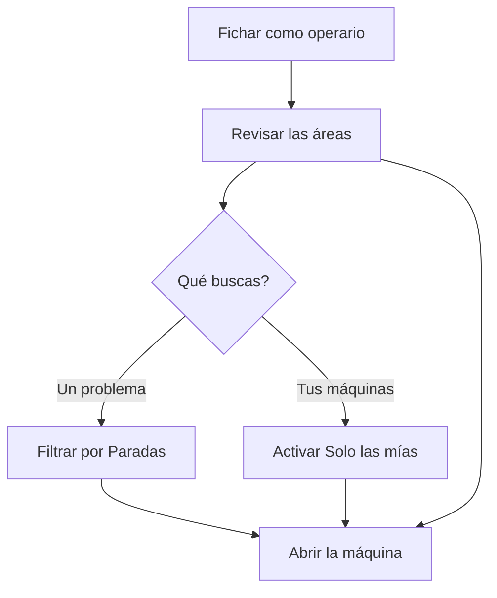

# Áreas de planta

## Para qué sirve esta pantalla

Muestra el estado de todas las máquinas de la planta, agrupadas por área. De un vistazo se ve qué máquinas están en marcha, cuáles están paradas y cuáles no tienen datos, cuánto tiempo llevan en ese estado y qué orden de fabricación tienen cargada. Desde aquí abres la máquina en la que tienes que trabajar: `fichaje -> áreas de planta -> máquina -> fase -> declaración de piezas`.

## Acciones disponibles

- Filtrar las máquinas por estado: «Todas», «En marcha», «Paradas» o «Sin datos». Cada filtro indica cuántas máquinas hay.
- Activar «Solo las mías» para ver solo las máquinas en las que has entrado.
- Plegar o desplegar un área tocando su cabecera.
- Abrir una máquina tocando su ficha (en la tableta) o su fila (en el móvil).
- Tocar tu nombre o tus iniciales, arriba a la derecha, y después «Salir» para dejar la tableta libre.

## Flujo habitual

1. Ficha con tu código en «Fichaje de operario».
2. Revisa las áreas: cada cabecera tiene una tira de cuadritos con el color del estado de cada máquina.
3. Si buscas un problema, toca «Paradas»; si quieres ir a tus máquinas, activa «Solo las mías».
4. Toca la máquina en la que tienes que trabajar para abrirla.
5. Cuando termines, sal de las máquinas y toca «Salir».

## Aspectos importantes

- Solo aparecen las áreas marcadas como «Visible en planta» en «Gestión de áreas», y solo las máquinas activas. Un área sin ninguna máquina que cumpla el filtro no aparece.
- El color de cada máquina es el color de su estado, definido en «Gestión de estados de máquina». La franja rayada en gris significa que la máquina no tiene datos.
- El tiempo es el que lleva la máquina en el estado actual: «38 min», «4 h 20 min» o «46 d 8 h». Avanza solo, sin recargar la pantalla. Una máquina sin datos muestra «—».
- «En marcha» y «Paradas» dependen de cómo está configurado cada estado (parada o cerrada). Una máquina sin estado, o con un estado que no está en el catálogo, cuenta como «Sin datos».
- Las máquinas sin orden cargada muestran el nombre, el estado, el tiempo y, si los hay, las iniciales de los operarios. Las que tienen una añaden la orden y la fase, la referencia y las piezas previstas.
- Al elegir un filtro de estado, se abren todas las áreas que tienen alguna máquina en ese estado.
- Las áreas plegadas y «Solo las mías» se recuerdan en este dispositivo.
- Arriba se ven el turno actual con su horario (no en el móvil), la hora y tu nombre.
- «Salir» no te saca de las máquinas: antes, toca «Salir de la máquina» en cada máquina en la que hayas entrado.

## Errores frecuentes

- Si una máquina aparece como «Sin datos», todavía no tiene ningún estado o su estado no está en el catálogo: ábrela y elige un estado.
- Si todas las máquinas aparecen como «Sin datos», puede que se haya perdido la conexión: recarga la pantalla.
- Si «Solo las mías» no muestra ninguna máquina, es que no has entrado en ninguna: abre la máquina y toca «Entrar en la máquina».
- Si aparece «Ningún centro en este estado.», ninguna máquina cumple el filtro: vuelve a «Todas» o desactiva «Solo las mías».
- Si un área no aparece nunca, pide al responsable que revise «Visible en planta» en «Gestión de áreas».

## Proceso básico

