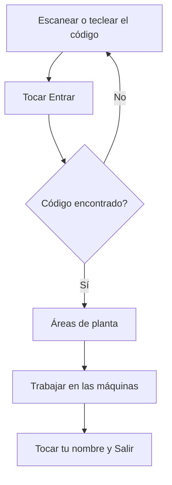

# Fichaje de operario

## Para qué sirve esta pantalla

Es la entrada a la planta. Aquí te identificas como operario con tu código antes de trabajar. Después pasas a las áreas de planta y eliges la máquina: `fichaje -> áreas de planta -> máquina -> fase -> declaración de piezas`.

Un operario no es un usuario de la aplicación. La tableta ya tiene la sesión iniciada con un usuario; cada operario solo introduce su código.

## Acciones disponibles

- Escanear tu código con el lector.
- Teclear el código con el teclado numérico de la pantalla.
- Tocar «ABC» para escribir letras con el teclado del dispositivo, y «123» para volver a los números.
- Borrar el último carácter con la tecla de borrar, abajo a la derecha del teclado.
- Tocar «Entrar» para acceder a la planta.

## Flujo habitual

1. Escanea tu código o tecléalo en el campo «Código de operario».
2. Toca «Entrar».
3. Se abren las áreas de planta, con tu nombre arriba a la derecha.
4. Trabaja en las máquinas que toque.
5. Cuando termines, toca tu nombre o tus iniciales, arriba a la derecha, y después «Salir». La tableta vuelve a esta pantalla.

## Aspectos importantes

- El código se muestra como puntos para que nadie lo vea.
- El código es el que tiene el operario en «Gestión de operarios». Tiene que ser exactamente igual, también las mayúsculas y las minúsculas.
- «Entrar» está desactivado mientras el campo está vacío.
- La tableta te recuerda: si se cierra o se recarga, sigues identificado. El siguiente operario no puede fichar hasta que tú toques «Salir».
- Fichar aquí no te hace entrar en ninguna máquina: solo indica quién usa la tableta. Para trabajar en una máquina, ábrela y toca «Entrar en la máquina».
- «Salir» tampoco te saca de las máquinas. Antes de salir, toca «Salir de la máquina» en cada máquina en la que hayas entrado.
- En pantallas anchas, junto al teclado se ven la hora, la fecha y el nombre de la empresa.

## Errores frecuentes

- Si aparece «No hay ningún operario con este código. Vuelve a probarlo.», revisa el código (también las mayúsculas) y vuelve a escanearlo. El campo se borra solo.
- Si el código es correcto y no lo encuentra, puede que el operario se haya dado de alta hace poco: recarga la pantalla. Si sigue igual, pide al responsable que revise el código en «Gestión de operarios».
- Si la pantalla pasa directamente a las áreas, es que ya hay un operario fichado en la tableta. Mira el nombre de arriba a la derecha; si no eres tú, tócalo y toca «Salir».
- Si no puedes escribir letras, toca «ABC».

## Proceso básico

