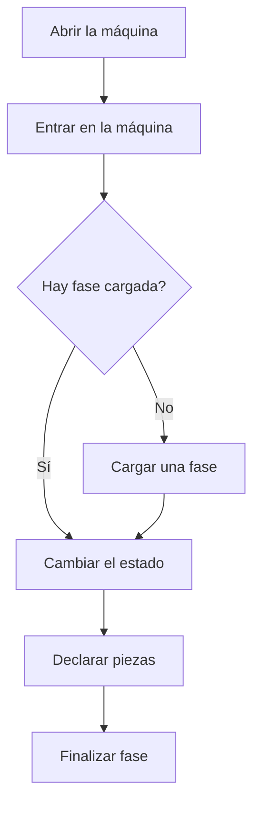

# Máquina de planta

## Para qué sirve esta pantalla

Es la pantalla de trabajo junto a la máquina. Muestra el estado de la máquina y el tiempo que lleva en él, la orden de fabricación y la fase cargadas, las piezas declaradas y los operarios que trabajan en ella. Desde aquí se carga una fase, se cambia el estado de la máquina, se declaran piezas y se finaliza la fase.

## Acciones disponibles

- Entrar o salir de la máquina como operario (botón de la placa, arriba).
- Cargar una fase desde la pestaña «Fases disponibles».
- Crear una fase nueva desde una plantilla, dentro del diálogo de carga.
- Cambiar el estado de la máquina con los botones de estado de la barra inferior, o elegir otro en «Otros estados».
- Declarar piezas buenas y malas con «Declarar piezas».
- Sacar la fase de la máquina con «Finalizar fase»: «Pausar» la deja a medias y «Finalizar» la da por terminada.
- Consultar el tiempo de la fase, la documentación, los comentarios y los materiales en las pestañas.
- Editar el comentario de la fase en «Comentarios» con «Editar».
- Mover material a la ubicación de aprovisionamiento de la máquina desde la pestaña «Materiales», con el botón de la columna «Stock».

## Flujo habitual

1. Abre la máquina desde las áreas de planta.
2. Toca «Entrar en la máquina» en la placa para registrar tu entrada.
3. Si no hay ninguna fase cargada, abre «Fases disponibles», toca «Cargar» en la orden que corresponda, elige la fase y la actividad, y toca «Cargar la actividad».
4. Cambia el estado de la máquina según lo que hagas (por ejemplo, preparación y después producción).
5. Declara las piezas a medida que las haces con «Declarar piezas».
6. Cuando termines, toca «Finalizar fase», revisa las piezas y toca «Finalizar».

## Aspectos importantes

- La placa, arriba, siempre muestra el estado actual con su color, el tiempo en ese estado y desde qué hora. También en el móvil.
- El botón del estado actual aparece relleno de su color y no se puede volver a pulsar. Los botones de estado son las actividades de la fase cargada y el estado de máquina cerrada. Si tocas el estado de máquina cerrada con una fase cargada, primero se abre «Finalizar fase».
- «Declarar piezas» y «Finalizar fase» solo aparecen cuando hay una fase cargada.
- Solo puedes entrar o salir de la máquina si el estado actual lo permite; si no, el botón aparece desactivado.
- En el diálogo de carga, las fases de otro tipo de máquina aparecen bloqueadas: no se pueden cargar en esta máquina.
- No se puede cargar una orden nueva mientras haya una fase en proceso en la máquina: primero hay que finalizarla.
- Al declarar piezas, el botón dice exactamente qué se declarará, por ejemplo «Declarar 8 buenas y 1 mala». Los motivos de las piezas malas son opcionales y se pueden repartir entre varios motivos.
- La pestaña «Fase actual» compara el tiempo real de máquina y de operario con el estimado, y avisa cuando se pasa.
- En el móvil, los botones «Estado» y «Más» abren una hoja con las opciones.
- En el diálogo «Finalizar fase» indicas las piezas y los motivos de rechazo. «Pausar» saca la fase de la máquina sin terminarla, y puedes volver a cargarla más tarde. «Finalizar» la da por terminada.
- En «Opciones» puedes marcar que se cargue la fase siguiente de la misma orden para este tipo de máquina, y elegir su actividad. Solo aparece si existe esa fase, y no aparece cuando el diálogo se abre desde el estado de máquina cerrada.
- Al sacar la fase, la máquina pasa al estado marcado como parada. Si el diálogo se ha abierto desde el estado de máquina cerrada, pasa a ese estado. Si cargas la fase siguiente, pasa a la actividad que has elegido.
- Si la fase tiene materiales, «Finalizar» exige que todos estén aprovisionados en la máquina y abre «Consumo de materiales». Por defecto se consume todo el material aprovisionado; si sobra, decláralo con «Añadir pieza» y toca «Confirmar consumo». La fase no se finaliza hasta que confirmas el consumo. «Pausar» no consume material.
- En «Comentarios» se ven los comentarios de la orden, de la fase y de las actividades. Solo el de la fase se puede editar.

## Errores frecuentes

- Si «Entrar en la máquina» aparece desactivado, cambia primero a un estado que permita operarios. Qué estados lo permiten se configura en «Gestión de estados de máquina».
- Si no puedes cargar una orden, comprueba que no haya una fase en proceso en la máquina y que la fase sea para este tipo de máquina.
- Si al declarar piezas aparece un aviso de cantidad, revisa que la cantidad no supere la que ha llegado de la fase anterior.
- Si el reparto de los motivos de las piezas malas no cuadra, la suma de los motivos tiene que coincidir con las piezas malas declaradas.
- Si aparece «Materiales no aprovisionados», mueve el material que falta a la ubicación de aprovisionamiento desde la pestaña «Materiales» y vuelve a finalizar.
- Si aparece «Actividad requerida», elige la actividad de la fase siguiente o desmarca la opción de cargarla.
- Si aparece «No se ha podido determinar el estado de salida de la fase», el ciclo de vida de las fases no permite pausar o cerrar la fase desde su estado actual: avisa al responsable para que lo revise en «Gestión de ciclos de vida».

## Proceso básico

