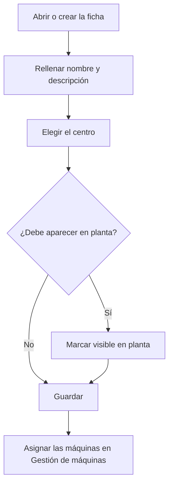

# Área

## Para qué sirve esta pantalla

Es la ficha de un área: el nombre, la descripción, el centro al que pertenece y si aparece en planta. El área es el tercer nivel de la estructura de planta (empresa -> centro -> área -> máquina) y sirve para agrupar las máquinas en la pantalla de áreas de planta que usan los operarios.

## Acciones disponibles

- Rellenar el «Nombre» y la «Descripción».
- Elegir en «Centro» el centro al que pertenece el área.
- Marcar o desmarcar «Visible en planta».
- Marcar o desmarcar «Desactivado».
- Guardar con «Guardar», en la cabecera. Después de guardar, la aplicación vuelve a la pantalla anterior.

## Flujo habitual

1. Desde «Gestión de áreas», pulsa «+» o haz clic en un área.
2. Rellena el nombre y la descripción.
3. Elige el centro en «Centro».
4. Deja marcado «Visible en planta» si los operarios deben ver el área en planta.
5. Guarda con «Guardar».
6. Asigna las máquinas al área desde la ficha de cada máquina, en «Gestión de máquinas».

## Aspectos importantes

- Son obligatorios el «Nombre», la «Descripción» y el «Centro». Las opciones del «Centro» son los centros de «Gestión de centros».
- El «Nombre» admite hasta 50 caracteres, y no se puede crear un área con el nombre de otra que ya existe.
- Un área nueva aparece con «Visible en planta» marcado.
- Si el área tiene «Visible en planta» y no está desactivada, aparece en la pantalla de áreas de planta con sus máquinas activas. Esa pantalla muestra las áreas visibles de todos los centros.
- Desmarcar «Visible en planta» o marcar «Desactivado» oculta el área y sus máquinas en la pantalla de planta, pero las máquinas siguen existiendo y se gestionan en «Gestión de máquinas».
- Las máquinas no se añaden desde aquí: cada máquina elige su área en su propia ficha.
- Para eliminar un área, hazlo desde la lista; consulta antes su ayuda, porque la eliminación es definitiva y puede borrar las máquinas del área.

## Errores frecuentes

- Si aparece «El nombre es obligatorio» o «La descripción es obligatoria», rellena el campo marcado.
- Si aparece «La ubicación es obligatoria», elige un centro en «Centro»; si la lista está vacía, crea primero el centro en «Gestión de centros».
- Si al crear el área aparece que ya existe, ya hay una con ese nombre: elige otro.
- Si al guardar aparece un error y el nombre es largo, acórtalo a 50 caracteres o menos.
- Si los operarios no ven el área en planta, comprueba que «Visible en planta» esté marcado y «Desactivado» no.

## Proceso básico

