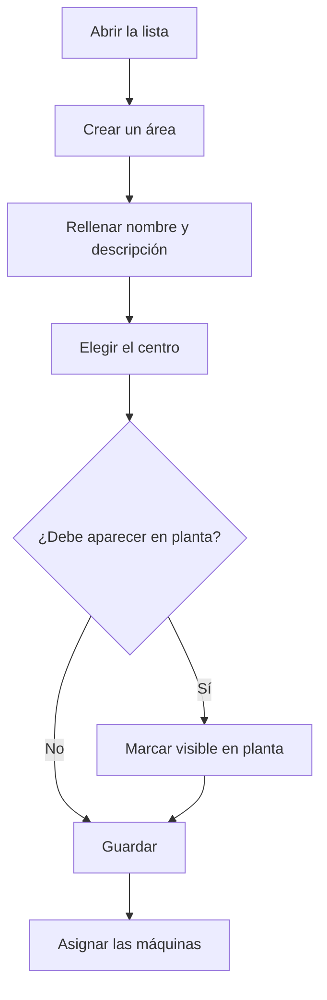

# Gestión de áreas

## Para qué sirve esta pantalla

Aquí se gestionan las áreas, el tercer nivel de la estructura de planta: empresa -> centro -> área -> máquina. Un área agrupa máquinas de un centro, por ejemplo una sección del taller. Cada máquina pertenece a un área, y la pantalla de áreas de planta que usan los operarios muestra las máquinas agrupadas por las áreas visibles en planta.

## Acciones disponibles

- Crear un área con el botón «+» («Crear nuevo») de la cabecera de la lista.
- Abrir un área haciendo clic en la fila (en el móvil, tocando su tarjeta) para modificarla.
- Eliminar un área con el icono de la papelera («Eliminar») de la fila, tras confirmarlo.
- Consultar en las columnas el «Nombre», la «Descripción», si es «Visible en planta» y si está «Desactivado».

## Flujo habitual

1. Comprueba en «Gestión de centros» que el centro ya existe.
2. Abre «Gestión de áreas» y pulsa «+».
3. Rellena el nombre y la descripción y elige el centro.
4. Decide si el área debe aparecer en planta y guarda.
5. En «Gestión de máquinas», asigna las máquinas al área desde la ficha de cada máquina.

## Aspectos importantes

- La lista no tiene filtros: muestra todas las áreas, también las desactivadas, ordenadas por nombre.
- En la pantalla de áreas de planta solo aparecen las áreas con «Visible en planta» que no están desactivadas, con sus máquinas activas.
- Los campos de la ficha se explican en la ayuda de la ficha del área.
- Eliminar un área es definitivo, y no se puede eliminar un área que tenga máquinas o materiales con esta «Área de producción». Si ya no la usas, márcala como «Desactivado» o quítala de planta en lugar de eliminarla.

## Errores frecuentes

- Si aparece «No se ha podido eliminar el área ...», el área ya está en uso: desactívala en lugar de eliminarla.
- Si un área no aparece en la pantalla de planta, comprueba que tenga «Visible en planta» y que no esté «Desactivado».
- Si una máquina aparece en un área equivocada, corrígelo en la ficha de la máquina, en «Gestión de máquinas».

## Proceso básico

