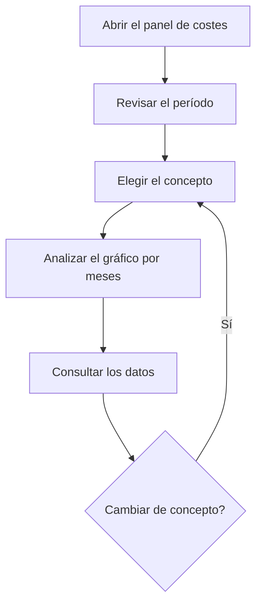

# Panel de costes de producción

## Para qué sirve esta pantalla

Muestra el coste de producción de cada mes repartido por operarios, por tipo de centro de trabajo o por centro de trabajo. Los datos salen de los tickets de producción, que recogen el tiempo trabajado en cada fase y el coste horario del operario y de la máquina. Sirve para ver dónde se acumula el coste de mano de obra y de máquina y cómo evoluciona mes a mes.

## Acciones disponibles

- Elegir el «Período» en el filtro. Por defecto va del primer día del mes de hace seis meses hasta hoy.
- Elegir el «Concepto»: «Operaris», «Tipus de centre de treball» o «Centre de treball» (las opciones aparecen en catalán). Los datos se cargan solos al cambiar el período o el concepto; no hace falta ningún botón de filtrar.
- Limpiar el filtro con el botón de limpiar filtros: vacía el período y el concepto.
- Ver el gráfico de barras en la pestaña «Gráficos».
- Consultar las cifras mes a mes en la pestaña «Datos».

## Flujo habitual

1. Abre el panel: el período ya viene puesto, pero no se muestra nada hasta que eliges un concepto.
2. Elige el «Concepto», por ejemplo «Tipus de centre de treball».
3. En «Gráficos», compara la altura de las barras de cada mes y pasa el ratón por encima para ver el importe de cada elemento y el total del mes.
4. Abre «Datos» para ver las horas y el coste exactos de cada mes.
5. Cambia a «Operaris» para ver el mismo período desde el punto de vista de la mano de obra.

## Aspectos importantes

- **De dónde salen los datos**: de los tickets de producción con fecha dentro del período. Los tickets se generan solos cuando se finaliza una fase en la máquina de planta, o se crean a mano en «Tickets de producción». Cada ticket cuenta en el mes de su fecha.
- **Operarios**: suma el tiempo de operario de los tickets y su coste (tiempo por el coste horario de operario guardado en el ticket), agrupado por operario y mes.
- **Tipo de centro de trabajo** y **Centro de trabajo**: suman el tiempo de máquina y su coste (tiempo por el coste horario de máquina guardado en el ticket), agrupados por tipo o por centro y mes. No incluyen el coste de operario.
- El coste se calcula con el coste horario que tenía cada ticket cuando se creó. Cambiar después los costes del operario o de la máquina no recalcula los tickets antiguos.
- Solo cuentan los tickets que tienen un operario asignado. El tiempo que una máquina ha trabajado sin ningún operario fichado no aparece en este panel, tampoco en «Centre de treball».
- **Gráficos**: barras apiladas, una columna por mes y un color por operario, tipo o centro. Al pasar el ratón por encima aparece el importe de cada elemento y el «Total» del mes.
- **Datos**: una fila por elemento y mes con «Año», «Mes» (en número), «Tiempo mensual» en horas y «Coste mensual» en euros. Según el concepto, solo se rellenan las columnas «Operario», «Tipo de centro» o «Centro de trabajo» que le corresponden.
- La pantalla solo consulta: no modifica ningún ticket.

## Errores frecuentes

- Si el gráfico muestra «Selecciona un intervalo de fechas y un concepto para visualizar los datos», elige un concepto y comprueba que el período tenga fecha de inicio y de fin.
- Si faltan los tickets del último día del período, es porque el día final no se incluye: elige como fecha final el día siguiente.
- Si un mes sale vacío o más bajo de lo previsto, comprueba que las fases se hayan finalizado en la máquina: hasta entonces no hay tickets.
- Si una máquina no aparece o sale con menos horas de las trabajadas, revisa si había operarios fichados: los tickets sin operario no se cuentan.
- Si salen horas pero el coste es 0, el ticket se creó sin coste horario. Revisa los costes configurados del operario o de la máquina para los tickets nuevos.

## Proceso básico

