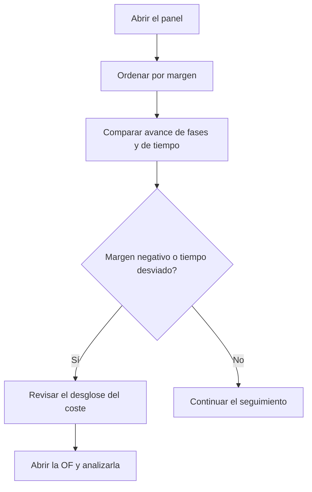

# Panel de producción

## Para qué sirve esta pantalla

Hace el seguimiento de las órdenes de fabricación (OF) que ahora mismo están en producción: cuánto han avanzado en fases y en tiempo, cuánto han costado hasta ahora y qué margen les queda respecto al precio. Sirve para detectar a tiempo las OF que se desvían del tiempo previsto o que ya han consumido más coste del que se cobrará.

## Acciones disponibles

- Buscar por código de OF, código de referencia o descripción de la referencia en el campo «Buscar». La lista se filtra mientras escribes.
- Ordenar por cualquier columna haciendo clic en la cabecera.
- Pasar el ratón por encima del porcentaje de «Avance de tiempo» para ver el tiempo real y el teórico en minutos.
- Pasar el ratón por encima del «Coste acumulado» para ver su desglose: material, máquina, operario y servicios externos.
- Abrir una OF haciendo clic en su fila.

## Flujo habitual

1. Abre el panel: aparecen todas las OF en estado «Producció», ordenadas por código.
2. Ordena por «Margen» para ver primero las OF con margen negativo (en rojo).
3. Compara «Avance de fases» con «Avance de tiempo»: si el tiempo avanza mucho más que las fases, la OF va más lenta de lo previsto.
4. Pasa el ratón por encima del «Coste acumulado» para ver qué concepto pesa más.
5. Haz clic en la OF para revisar sus fases, sus tickets y el material.

## Aspectos importantes

- **Qué OF aparecen**: solo las que tienen el estado «Producció». No hay filtro de fechas: el panel siempre muestra la situación actual.
- **«Cantidad»**: la cantidad planificada de la OF.
- **«Avance de fases»**: porcentaje de fases de la OF que están en estado «Tancada» sobre el total de fases.
- **«Avance de tiempo»**: tiempo real de máquina de los tickets de producción de la OF dividido por el tiempo teórico de todas las fases. El tiempo teórico suma los tiempos estimados de los pasos; los pasos por tiempo de ciclo se multiplican por la cantidad planificada. Por encima del 100 % la barra se pone roja.
- **«Precio del pedido»**: precio unitario de la ficha de la referencia multiplicado por la cantidad planificada. No es el precio de la línea del pedido de venta.
- **«Coste teórico»**: coste teórico de fabricación de la ficha de la referencia multiplicado por la cantidad planificada. Es informativo: no entra en el cálculo del margen.
- **«Coste acumulado»**: suma de operario, máquina, material y servicios externos:
  - Operario y máquina: tiempo de cada ticket de producción de la OF por el coste horario guardado en el mismo ticket.
  - Material: movimientos de consumo de almacén vinculados a las fases de la OF, valorados con el último coste de la referencia consumida. Las devoluciones restan.
  - Servicios externos: coste del servicio y del transporte de las fases externas que ya están en estado «Tancada».
- **«Margen»**: «Precio del pedido» menos «Coste acumulado». Rojo si es negativo, naranja si es cero y verde si es positivo. Mientras la OF avanza el margen baja, porque el precio es el total y el coste solo lo que se ha hecho hasta ahora.
- Los tickets de producción se generan solos cuando se finaliza una fase en la máquina de planta, o se crean a mano en «Tickets de producción». El tiempo de una fase que aún se está haciendo no cuenta hasta que se finaliza.
- La pantalla solo consulta: no modifica nada.

## Errores frecuentes

- Si aparece «No hay órdenes de fabricación en producción.», ninguna OF tiene el estado «Producció». Las OF en otros estados (por ejemplo, lanzadas o en pausa) no aparecen.
- Si una OF tiene «Avance de tiempo» al 0 %, aún no tiene tickets de producción: ninguna fase se ha finalizado en la máquina.
- Si el «Precio del pedido» o el «Coste teórico» salen a 0, revisa el precio unitario y el coste teórico de fabricación en la ficha de la referencia.
- Si el material del «Coste acumulado» sale a 0, no hay consumos de almacén vinculados a las fases de la OF.
- Si los servicios externos no aparecen, comprueba que la fase externa esté en estado «Tancada».
- Si aparece «Error al cargar el panel de producción», vuelve a abrir la pantalla. Si persiste, avisa al administrador.

## Proceso básico

