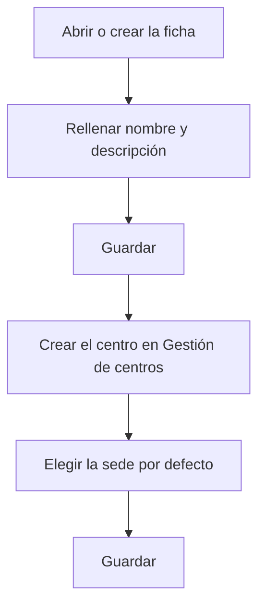

# Empresa

## Para qué sirve esta pantalla

Es la ficha de una empresa: el nombre, la descripción, el centro predeterminado y si está activa. La empresa es el primer nivel de la estructura de planta (empresa -> centro -> área -> máquina). El «Nombre» aparece como nombre de la empresa en la cabecera de los documentos impresos, y la «Sede por defecto» es el centro que se asigna a los pedidos, albaranes y facturas de venta nuevos.

## Acciones disponibles

- Rellenar el «Nombre» y la «Descripción».
- Elegir el centro en «Sede por defecto».
- Marcar o desmarcar «Desactivado».
- Guardar con «Guardar», en la cabecera. Después de guardar, la aplicación vuelve a la pantalla anterior.
- Salir sin guardar con el botón de volver atrás de la cabecera.

## Flujo habitual

1. Desde «Gestión de empresas», pulsa «+» para crear una empresa nueva o haz clic en una fila para abrir una existente.
2. Rellena el «Nombre» (corto, hasta 10 caracteres) y la «Descripción».
3. Guarda con «Guardar».
4. En «Gestión de centros», crea el centro de la empresa y elige esta empresa en el campo «Empresa».
5. Vuelve a abrir la empresa, elige el centro en «Sede por defecto» y guarda.

## Aspectos importantes

- «Nombre» y «Descripción» son obligatorios. El nombre admite como máximo 10 caracteres, aunque el campo permita escribir más.
- No se puede crear una empresa con el nombre de otra que ya existe.
- «Sede por defecto» solo muestra los centros que pertenecen a esta empresa. En una empresa nueva la lista sale vacía hasta que le creas un centro.
- Si «Sede por defecto» queda vacía, no se pueden crear pedidos, albaranes ni facturas de venta.
- Solo puede haber una empresa activa. Si desmarcas «Desactivado» mientras hay otra activa, el guardado falla.
- Si desactivas la única empresa activa, tampoco se pueden crear pedidos, albaranes ni facturas de venta.
- El logotipo, el color y el nombre comercial se configuran en la pantalla «Branding». Guardar esta ficha no los modifica.
- Si se elimina el centro elegido como «Sede por defecto», el campo queda vacío y hay que elegir otro.
- Para eliminar una empresa, hazlo desde la lista; consulta antes su ayuda, porque la eliminación es definitiva.

## Errores frecuentes

- Si aparece «El nombre es obligatorio» o «La descripción es obligatoria», rellena el campo marcado.
- Si al guardar aparece un error y el nombre es largo, acórtalo a 10 caracteres o menos.
- Si al crear la empresa aparece que ya existe, ya hay una con ese nombre: elige otro.
- Si al guardar una empresa sin «Desactivado» aparece un error, comprueba en «Gestión de empresas» que no haya otra activa.
- Si «Sede por defecto» no muestra ninguna opción, crea primero un centro de esta empresa en «Gestión de centros».

## Proceso básico

