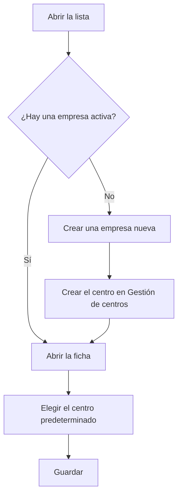

# Gestión de empresas

## Para qué sirve esta pantalla

Aquí se da de alta la empresa que trabaja con el ERP. Es el primer nivel de la estructura de planta: empresa -> centro -> área -> máquina. La empresa activa y su centro predeterminado son los que la aplicación usa al crear pedidos, albaranes y facturas de venta, y el nombre de la empresa aparece en la cabecera de los documentos impresos. Normalmente solo hay una.

## Acciones disponibles

- Crear una empresa con el botón «+» («Crear nuevo») de la cabecera de la lista.
- Abrir una empresa haciendo clic en la fila (en el móvil, tocando su tarjeta) para modificarla.
- Eliminar una empresa con el icono de la papelera («Eliminar») de la fila, tras confirmarlo.
- Consultar en las columnas el «Nombre», la «Descripción», el «Centro predeterminado» y si está «Desactivado».

## Flujo habitual

1. Abre «Gestión de empresas» y comprueba si ya hay una empresa activa, es decir, sin «Desactivado».
2. Si no hay ninguna, pulsa «+», rellena el nombre y la descripción y guarda.
3. Ve a «Gestión de centros» y crea el centro de la empresa con la dirección y los datos fiscales.
4. Vuelve aquí, abre la empresa y elige ese centro en «Sede por defecto».
5. Configura el logotipo y los colores de la empresa en la pantalla «Branding».

## Aspectos importantes

- Solo puede haber una empresa activa a la vez. Para activar otra, primero hay que marcar la actual como «Desactivado».
- Si no hay ninguna empresa activa, o la empresa activa no tiene centro predeterminado, no se pueden crear pedidos, albaranes ni facturas de venta.
- La lista no tiene filtros: muestra todas las empresas, también las desactivadas, ordenadas por nombre.
- El detalle de cada campo se explica en la ayuda de la ficha de la empresa.
- Eliminar una empresa es definitivo. También se borran sus logotipos de «Branding» y puede arrastrar los datos que dependen de ella, como los centros y, con ellos, las áreas y las máquinas. Si alguno de esos datos ya se ha usado, la eliminación puede fallar. Si ya no la usas, márcala como «Desactivado» en lugar de eliminarla.

## Errores frecuentes

- Si al eliminar una empresa aparece un error, es que ella o sus centros ya tienen datos vinculados: desactívala en lugar de eliminarla.
- Si al crear un pedido, un albarán o una factura de venta aparece que la sede no existe, comprueba aquí que haya exactamente una empresa activa y que tenga «Centro predeterminado».
- Si la columna «Centro predeterminado» sale vacía, abre la empresa y elige el centro en «Sede por defecto».

## Proceso básico

