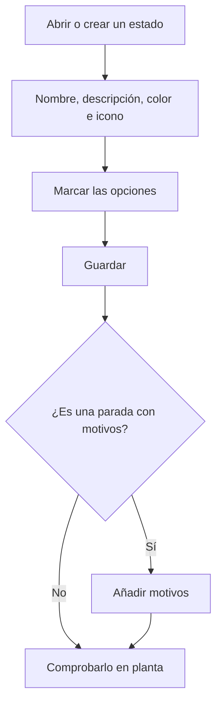

# Estado de máquina

## Para qué sirve esta pantalla

Es la ficha de un estado de máquina. Aquí se decide cómo se ve el estado en planta (nombre, color e icono), cómo se comporta (si es una parada, si admite operarios, si cierra la máquina) y qué motivos puede elegir el operario cuando pone la máquina en ese estado.

## Acciones disponibles

- Rellenar el «Nombre», la «Descripción», el «Color» y el «Icono» («Selecciona un icono»).
- Marcar las opciones «Parada», «Operarios», «Cerrada», «Preferida», «Permite OF» y «Desactivado».
- Guardar con «Guardar», en la cabecera. Al guardar, vuelves a la lista.
- En la tabla «Motivos», añadir un motivo con «Añadir motivo», editarlo con el icono del lápiz o eliminarlo con la papelera. La tabla solo aparece cuando el estado ya está guardado.

## Flujo habitual

1. Desde «Estados de máquina», pulsa «+» o abre un estado.
2. Rellena el nombre, la descripción y el color, y elige un icono.
3. Marca las opciones según cómo debe comportarse en planta.
4. Pulsa «Guardar».
5. Si es una parada, vuelve a abrir el estado y añade los motivos con «Añadir motivo».
6. Abre una máquina en planta y comprueba que el estado aparece como esperabas.

## Aspectos importantes

- El «Nombre», la «Descripción» y el «Color» son obligatorios. El color pinta los botones de estado y la placa de la máquina en planta; el icono aparece en las tarjetas de «Otros estados».
- «Parada»: el estado cuenta como una parada. Si tiene motivos, cuando el operario lo elige en «Otros estados» también debe escoger un motivo, que después aparece en la placa de la máquina como «Motivo: ...». Al finalizar una fase sin cargar otra, la máquina pasa a un estado marcado como «Parada».
- «Operarios»: solo mientras la máquina está en un estado con esta opción el operario puede entrar o salir de la máquina. Un estado nuevo la trae marcada.
- «Cerrada»: es el estado del botón para parar la máquina en la barra de estados de planta. Si hay una fase cargada, ese botón abre primero la finalización de la fase.
- «Preferida»: el estado aparece primero en la lista de «Otros estados».
- «Desactivado»: el estado deja de aparecer en planta y en el desplegable de estados de las plantillas de fase.
- Los motivos se guardan al aceptar su diálogo, sin pulsar «Guardar» del estado. Cada motivo necesita un «Código» único dentro del estado (máximo 20 caracteres), un «Nombre» (máximo 100) y un «Color»; la «Descripción» y el «Icono» son opcionales.
- Eliminar un motivo es inmediato y definitivo: no pide confirmación.
- Los cambios se ven en planta la próxima vez que se abre la pantalla de la máquina.

## Errores frecuentes

- Si no puedes guardar, revisa los avisos «El nombre es obligatorio», «La descripción es obligatoria» y «El color es obligatorio».
- Si al crear aparece «La entidad ya existe», ya hay un estado con ese nombre.
- Si al guardar un estado con un nombre largo aparece un error, acórtalo: el nombre debe tener 50 caracteres o menos.
- Si aparece «Ya existe un motivo con este código para este estado de máquina», elige otro código para el motivo.
- Si en planta no se pide ningún motivo al elegir el estado, comprueba que esté marcado como «Parada» y que tenga motivos.
- Si el operario no puede entrar en la máquina, el estado actual no tiene marcada la opción «Operarios».

## Proceso básico

