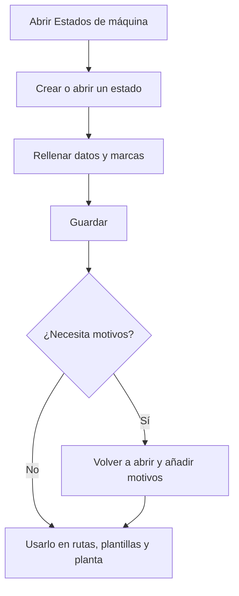

# Gestión de estados de máquina

## Para qué sirve esta pantalla

Aquí se definen los estados en los que puede estar una máquina en planta, como preparación, producción, pausa o parada. Cada paso de una ruta de fabricación, cada actividad de una fase de orden de fabricación y cada detalle de una plantilla de fase indica un estado de máquina. En planta, estos estados son los botones con los que el operario cambia el estado de la máquina. También se usan en «Costes por máquina».

## Acciones disponibles

- Crear un estado nuevo con el botón «+» («Crear nuevo») de la cabecera de la tabla.
- Abrir un estado haciendo clic en la fila para modificar sus datos y sus motivos.
- Eliminar un estado con el icono de la papelera de la fila, tras confirmarlo.
- Revisar de un vistazo el «Color», el «Icono» y las marcas «Parada», «Operarios», «Cerrada», «Preferido», «Permite OF» y «Desactivado» de cada estado.

## Flujo habitual

1. Abre «Estados de máquina». La lista sale ordenada por nombre.
2. Pulsa «+» para crear un estado, o haz clic en una fila para modificarlo.
3. Rellena el nombre, la descripción y el color, y marca las opciones necesarias.
4. Pulsa «Guardar». Vuelves a la lista.
5. Si el estado necesita motivos, por ejemplo una parada, vuelve a abrirlo y añádelos en «Motivos».

## Aspectos importantes

- La lista muestra todos los estados, también los desactivados. No tiene filtros.
- Los estados desactivados no aparecen en planta ni en el desplegable de estados de las plantillas de fase.
- En planta, los estados se vuelven a leer cada vez que se abre la pantalla de una máquina.
- El estado marcado como «Cerrada» es el botón para parar la máquina en la barra de estados de planta. Marca solo uno.
- Al finalizar una fase en planta sin cargar otra, la máquina pasa al estado marcado como «Parada».
- En las áreas de planta, las máquinas en un estado «Parada» o «Cerrada» cuentan como «Paradas».
- La eliminación es definitiva y puede borrar también datos que dependen del estado: sus motivos, los detalles de plantillas de fase, los pasos de rutas de fabricación, los costes por máquina y el historial de turnos que lo usan. Si el estado ya se ha usado, márcalo como «Desactivado» en lugar de eliminarlo.
- El significado de cada marca se explica en la ayuda de «Estado de máquina».

## Errores frecuentes

- Si al crear un estado aparece «La entidad ya existe», ya hay un estado con ese nombre.
- Si no se puede eliminar un estado, márcalo como «Desactivado»: dejará de aparecer en planta.
- Si en planta falta el botón para parar la máquina o aparece «No se ha encontrado el estado de máquina cerrada», marca un estado activo como «Cerrada».

## Proceso básico

