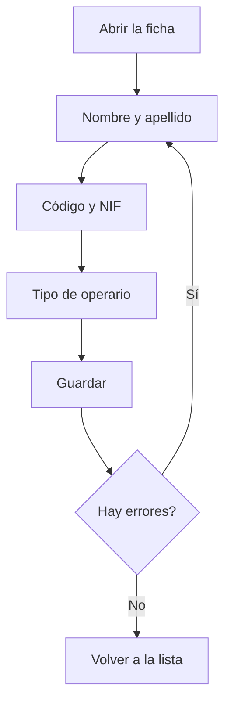

# Operario

## Para qué sirve esta pantalla

Es la ficha de un operario. Aquí se da de alta un operario nuevo («Alta de operario») o se modifican los datos de uno existente («Operario: nombre»). Los datos que más importan son el código, que el operario escribe para fichar en planta, y el tipo de operario, que fija el coste/hora que se imputa cuando trabaja en una máquina.

## Acciones disponibles

- Rellenar o modificar «Nombre», «Apellido», «Código» y «NIF».
- Elegir el «Tipo de operario».
- Marcar o desmarcar «Desactivado».
- Guardar con «Guardar», en la cabecera de la pantalla.
- Volver a la lista con el botón de volver atrás, sin guardar.

## Flujo habitual

1. Desde «Gestión de operarios», pulsa «Nuevo» o abre un operario.
2. Escribe el nombre y el apellido.
3. Asígnale un código corto que no tenga ningún otro operario.
4. Escribe el NIF.
5. Elige el tipo de operario.
6. Pulsa «Guardar». Aparece «Operario creado correctamente» u «Operario actualizado correctamente» y vuelves a la lista.

## Aspectos importantes

- Todos los campos de texto y el tipo de operario son obligatorios. El código admite como máximo 10 caracteres, el NIF 20 y el nombre y el apellido 250.
- El código es el que el operario escribe en «Código de operario» en la pantalla «Fichaje de operario». Debe coincidir exactamente, mayúsculas y minúsculas incluidas.
- El sistema comprueba que el código no se repita cuando creas un operario, pero no cuando modificas uno. No cambies el código de un operario por uno que ya usa otro.
- El tipo de operario da el coste/hora del operario. Cuando el operario ficha en una máquina, se guarda el coste/hora que tiene su tipo en ese momento. Cambiarle el tipo después no modifica los costes ya registrados; solo afecta a los fichajes nuevos.
- El selector «Tipo de operario» también muestra los tipos desactivados: elige uno activo.
- Si el operario ya tiene actividad registrada, no se puede eliminar: marca «Desactivado» para darlo de baja y conservar su histórico.

## Errores frecuentes

- Si «Guardar» no guarda, revisa los mensajes bajo los campos: falta un campo obligatorio o se supera la longitud máxima, por ejemplo «El código no puede superar los 10 caracteres».
- Si aparece «Operario ... existente», el código ya está asignado a otro operario: cámbialo.
- Si el selector «Tipo de operario» aparece vacío, crea primero los tipos en «Gestión de tipos de operario».

## Proceso básico

