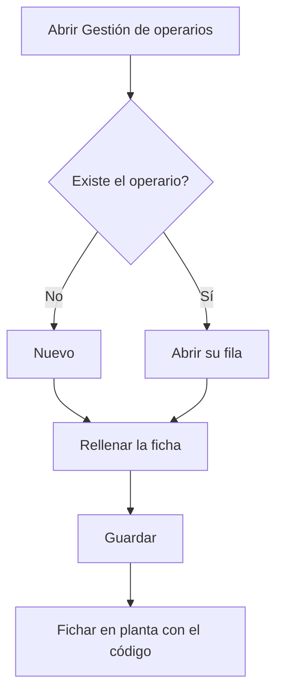

# Gestión de operarios

## Para qué sirve esta pantalla

Lista todos los operarios con su código, nombre completo, NIF, tipo de operario y si están desactivados. Desde aquí se dan de alta operarios nuevos, se abre la ficha de un operario para modificarlo y se eliminan los que se han creado por error. El código del operario es el que escribe para fichar en planta, en la pantalla «Fichaje de operario», y su tipo de operario fija el coste/hora que se imputa cuando trabaja en una máquina.

## Acciones disponibles

- Crear un operario con el botón «Nuevo»: se abre la ficha «Alta de operario».
- Abrir la ficha de un operario haciendo clic en su fila, para modificar sus datos.
- Eliminar un operario con el icono de la papelera de su fila, tras confirmarlo.
- Consultar en la columna «Tipo» el tipo de operario asignado y en «Desactivado» si está desactivado.

## Flujo habitual

1. Comprueba en «Gestión de tipos de operario» que ya existe el tipo que tendrá el operario.
2. Pulsa «Nuevo».
3. Rellena el nombre, el apellido, el código, el NIF y el tipo de operario.
4. Guarda con «Guardar»: vuelves a la lista y el operario ya aparece.
5. Comunica el código al operario para que pueda fichar en planta.

## Aspectos importantes

- La lista está ordenada por el nombre del operario y no tiene filtros.
- El código identifica al operario cuando ficha en planta: debe escribirlo exactamente igual, respetando mayúsculas y minúsculas.
- Al crear un operario, el sistema no deja repetir un código que ya existe.
- La eliminación es definitiva. Solo se puede eliminar un operario que todavía no tiene actividad registrada, como fichajes en máquinas o piezas declaradas. Si ya la tiene, abre su ficha y marca «Desactivado» para conservar su histórico.
- Los campos de la ficha y sus reglas se explican en la ayuda de la pantalla «Operario».

## Errores frecuentes

- Si al guardar un operario nuevo aparece el mensaje «Operario ... existente», el código ya lo usa otro operario: elige otro.
- Si al eliminar aparece «Conflicto con el estado actual del recurso», el operario ya tiene actividad registrada y no se puede borrar: desactívalo.
- Si un operario no puede entrar en planta, comprueba en la columna «Código» que el código es exactamente el que escribe.

## Proceso básico

