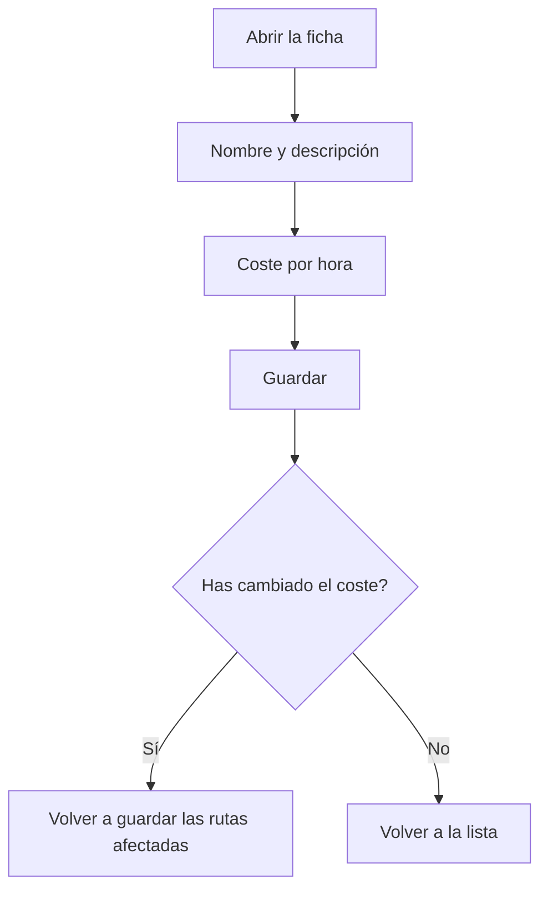

# Tipo de operario

## Para qué sirve esta pantalla

Es la ficha de un tipo de operario. Aquí se da de alta un tipo nuevo («Alta de tipo de operario») o se modifica uno existente («Tipo de operario: nombre»). El dato clave es el «Coste/hora», que el sistema aplica al tiempo de trabajo de los operarios de este tipo para calcular el coste de mano de obra de las rutas y de las órdenes de fabricación.

## Acciones disponibles

- Rellenar o modificar «Nombre» y «Descripción».
- Indicar el «Coste/hora» en euros.
- Marcar o desmarcar «Desactivado».
- Guardar con «Guardar», en la cabecera de la pantalla.
- Volver a la lista con el botón de volver atrás, sin guardar.

## Flujo habitual

1. Desde «Gestión de tipos de operario», pulsa «Nuevo» o abre un tipo.
2. Escribe un nombre corto y una descripción.
3. Indica el coste/hora.
4. Pulsa «Guardar». Aparece «Tipo de operario creado correctamente» o «Tipo de operario actualizado correctamente» y vuelves a la lista.
5. Si has cambiado el coste, vuelve a guardar las rutas de fabricación que lo usan para que se recalcule su coste estimado.

## Aspectos importantes

- «Nombre», «Descripción» y «Coste/hora» son obligatorios. El nombre y la descripción admiten como máximo 250 caracteres, y el coste no puede ser negativo.
- El nombre debe ser único: el sistema lo comprueba al crear el tipo.
- Coste estimado: en cada fase de una ruta de fabricación se elige un tipo de operario. El coste de operario de la ruta es el tiempo de operario de la fase multiplicado por el coste/hora del tipo, y se recalcula cada vez que se guarda la ruta.
- Coste real: cuando un operario ficha en una máquina, se guarda el coste/hora de su tipo en ese momento. Con este valor se calculan el «Coste operario» del «Histórico» y el coste de operario de las órdenes de fabricación.
- Cambiar el coste/hora no modifica los fichajes ya hechos: solo afecta a los fichajes nuevos y a las rutas cuando se vuelven a guardar.
- Un tipo desactivado deja de aparecer en el selector «Tipo de operario» de las fases de rutas y de órdenes de fabricación.

## Errores frecuentes

- Si aparece «Tipo de operario ... existente», ya hay un tipo con ese nombre: cámbialo.
- Si aparece «El coste es obligatorio» o «El coste no puede ser negativo», escribe un coste igual o superior a cero.
- Si el coste de operario de una ruta sale a cero, comprueba que sus fases tienen un tipo de operario elegido y que ese tipo tiene coste/hora.

## Proceso básico

