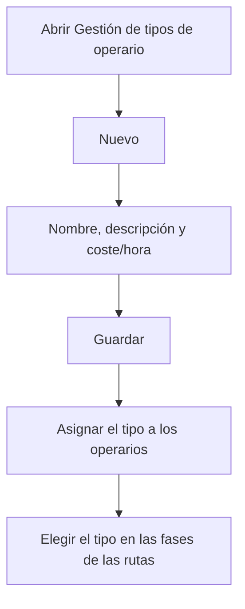

# Gestión de tipos de operario

## Para qué sirve esta pantalla

Lista los tipos de operario. Cada tipo tiene un coste/hora que el sistema usa para calcular el coste de mano de obra: el coste estimado de las rutas de fabricación, según el tipo de operario de cada fase, y el coste real cuando los operarios fichan en las máquinas. Cada operario tiene un tipo asignado en «Gestión de operarios».

## Acciones disponibles

- Crear un tipo de operario con el botón «Nuevo»: se abre la ficha «Alta de tipo de operario».
- Abrir la ficha de un tipo haciendo clic en su fila, para cambiar su nombre, su descripción o su coste/hora.
- Eliminar un tipo con el icono de la papelera de su fila, tras confirmarlo.
- Consultar en la columna «Desactivado» qué tipos están desactivados.

## Flujo habitual

1. Pulsa «Nuevo».
2. Rellena el nombre, la descripción y el coste/hora.
3. Guarda con «Guardar».
4. Asigna el tipo a los operarios en «Gestión de operarios».
5. Elígelo en las fases de las rutas de fabricación para que el coste estimado incluya la mano de obra.

## Aspectos importantes

- La lista está ordenada por la descripción y no tiene filtros.
- Al eliminar un tipo de operario, también se eliminan los operarios que lo tienen asignado. Revísalos antes en «Gestión de operarios».
- No se puede eliminar un tipo que se usa en las fases de rutas o de órdenes de fabricación, ni si alguno de sus operarios ya tiene actividad registrada. En estos casos, márcalo como «Desactivado».
- Un tipo desactivado deja de aparecer en el selector «Tipo de operario» de las fases de rutas y de órdenes de fabricación.
- Los campos de la ficha y cómo se aplica el coste/hora se explican en la ayuda de la pantalla «Tipo de operario».

## Errores frecuentes

- Si al guardar un tipo nuevo aparece «Tipo de operario ... existente», ya hay un tipo con ese nombre.
- Si al eliminar aparece «Conflicto con el estado actual del recurso», el tipo se usa en alguna fase o alguno de sus operarios ya tiene actividad: desactívalo en lugar de eliminarlo.

## Proceso básico

