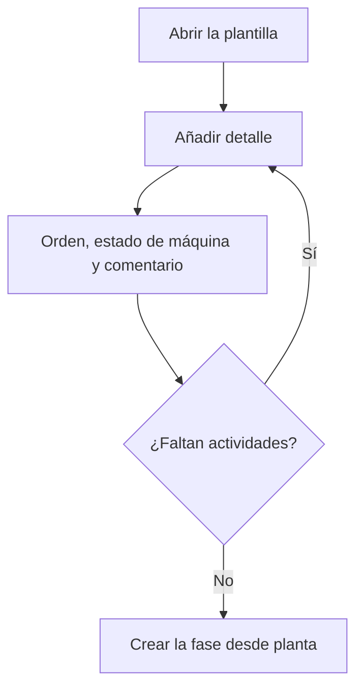

# Plantilla de fase

## Para qué sirve esta pantalla

Es la ficha de una plantilla de fase. Arriba están el nombre y la descripción; debajo, la tabla «Detalles de la plantilla» con las actividades. Cada detalle es un estado de máquina con un orden y un comentario. Cuando en planta se crea una fase desde esta plantilla, cada detalle se convierte en una actividad de la fase, es decir, en un botón de estado de la máquina.

## Acciones disponibles

- Modificar el «Nombre», la «Descripción» y «Desactivada», y guardarlo con «Guardar», en la cabecera.
- Añadir un detalle con el botón «+» («Añadir detalle») de «Detalles de la plantilla». Se abre el diálogo «Crear detalle» con «Orden», «Estado de máquina» y «Comentario».
- Editar un detalle haciendo clic en la fila (diálogo «Editar detalle»).
- Eliminar un detalle con la cruz de la fila, tras confirmarlo.

## Flujo habitual

1. Desde «Plantillas de fase», crea una plantilla o abre una.
2. Pulsa «+» en «Detalles de la plantilla».
3. Revisa el orden propuesto, elige el «Estado de máquina» y, si hace falta, escribe un comentario para el operario.
4. Pulsa «Guardar» en el diálogo y repítelo para cada actividad.
5. Comprueba en la tabla que las actividades salen en el orden correcto.
6. Si has cambiado el nombre, la descripción o «Desactivada», pulsa «Guardar» en la cabecera.

## Aspectos importantes

- Los detalles se guardan al aceptar su diálogo. El «Guardar» de la cabecera solo guarda el nombre, la descripción y «Desactivada», y te deja en la misma pantalla.
- El orden de un detalle nuevo se propone en múltiplos de 10 según los detalles que ya hay (10, 20, 30...). Debe ser positivo. La tabla y los botones de actividad de planta siguen este orden.
- El desplegable «Estado de máquina» solo muestra los estados activos, y los muestra por su descripción; la tabla muestra el nombre del estado.
- «Desactivada» oculta la plantilla del diálogo de planta.
- Para crear la fase en planta hay que elegir la plantilla, escribir el «Código de la fase» (solo números) y la «Descripción de la fase», revisar el «Centro de trabajo» y pulsar «Crear fase».
- La fase creada copia las actividades con el orden y el comentario, pero sin tiempos estimados. Los cambios posteriores en la plantilla no afectan a las fases ya creadas.
- Una plantilla sin detalles crea una fase sin actividades.

## Errores frecuentes

- Si el diálogo no se guarda, revisa «El orden es obligatorio», «El orden debe ser positivo» y «El estado de máquina es obligatorio».
- Si al guardar la cabecera aparece «El nombre es obligatorio», rellena el «Nombre».
- Si un detalle aparece en la tabla sin estado de máquina, el estado que tenía está desactivado: edita el detalle y elige un estado activo.
- Si no encuentras un estado en el desplegable, comprueba en «Estados de máquina» que no esté desactivado.
- Si en planta aparece «El código de la fase debe ser numérico», escribe el código solo con cifras.

## Proceso básico

