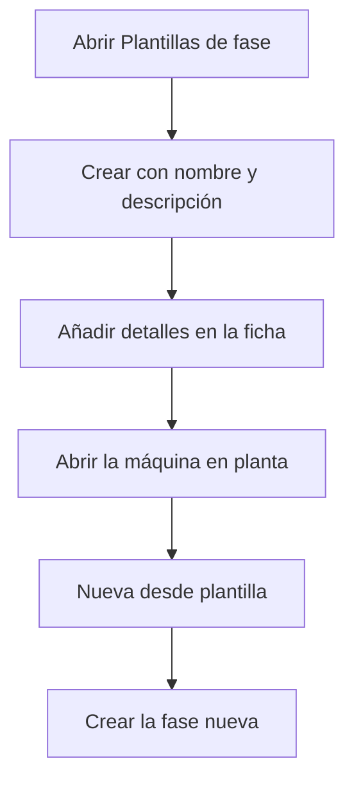

# Plantillas de fase

## Para qué sirve esta pantalla

Una plantilla de fase es una lista ordenada de actividades, cada una con un estado de máquina y un comentario. Sirve para crear una fase nueva de una orden de fabricación directamente en planta, desde el diálogo «Cargar una fase», pestaña «Nueva desde plantilla», sin tener que definir las actividades a mano. Esta pantalla lista las plantillas y permite crearlas, abrirlas y eliminarlas.

## Acciones disponibles

- Crear una plantilla con el botón «+» («Crear nuevo»): se abre el diálogo «Crear plantilla de fase» con el «Nombre» y la «Descripción».
- Abrir una plantilla haciendo clic en la fila para editarla y añadirle detalles.
- Eliminar una plantilla con el icono de la papelera de la fila, tras confirmarlo.

## Flujo habitual

1. Abre «Plantillas de fase». La lista sale ordenada por nombre.
2. Pulsa «+», escribe el nombre y, si hace falta, la descripción.
3. Pulsa «Guardar». Se abre directamente la ficha de la plantilla nueva.
4. En la ficha, añade los detalles: el orden, el estado de máquina y el comentario de cada actividad.
5. En planta, abre la máquina, abre el diálogo de carga, ve a «Nueva desde plantilla», elige la plantilla y crea la fase.

## Aspectos importantes

- La lista muestra todas las plantillas, también las desactivadas. No tiene filtros.
- En planta solo aparecen las plantillas que no están desactivadas.
- Una plantilla nueva no tiene detalles: añádelos en la ficha antes de usarla, o la fase que se cree no tendrá actividades.
- La eliminación es definitiva y borra también los detalles de la plantilla.
- Las fases ya creadas desde una plantilla no cambian si después se modifica o se elimina la plantilla: al crear la fase, se copian sus actividades.

## Errores frecuentes

- Si al crear aparece «El nombre es obligatorio», rellena el «Nombre» antes de guardar.
- Si una plantilla no aparece en planta, comprueba que no esté marcada como «Desactivada».
- Si en planta aparece «No se han encontrado plantillas de fase activas», no hay ninguna plantilla o todas están desactivadas.

## Proceso básico

