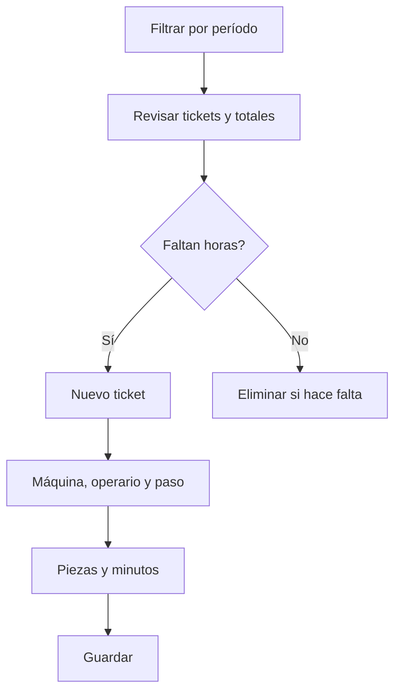

# Tickets de producción

## Para qué sirve esta pantalla

Reúne todos los tickets de producción: cada ticket declara, para una máquina, un operario y un paso de una fase de una orden de fabricación (OF), las piezas hechas y los minutos de máquina y de operario. Sirve para revisar y corregir las horas imputadas y su coste en un período. Los tickets alimentan las horas, las cantidades y los costes de cada OF.

## Acciones disponibles

- Filtrar con «Filtros» por «Período», «Máquina», «Operario» y «OF», y aplicar con «Filtrar».
- Vaciar los filtros con «Limpiar».
- Crear un ticket manual con «Nuevo», que abre «Crear ticket de producción».
- Eliminar un ticket con la cruz de la fila, después de confirmarlo.
- Consultar a pie de tabla los totales de «Cantidad», «Tiempo máquina», «Tiempo operario», «Coste operario» y «Coste máquina».

## Flujo habitual

1. Revisa el «Período»: por defecto es el ejercicio del año en curso.
2. Filtra por «Máquina», «Operario» u «OF» si hace falta y pulsa «Filtrar».
3. Revisa los tickets y los totales del pie de tabla.
4. Para imputar horas que no se han declarado en planta, pulsa «Nuevo».
5. Elige la «Máquina», el «Operario» y la «Fecha del ticket»; después, en «Orden de fabricación | Fase | Actividad», elige la OF, la fase y el paso.
6. Informa la «Cantidad», el «Tiempo del centro de trabajo (minutos)» y el «Tiempo de operario (minutos)», y guarda.

## Aspectos importantes

- El «Período» es obligatorio y filtra por la fecha del ticket. La lista de OF del filtro incluye las OF con fecha prevista dentro del mismo período.
- Los filtros se guardan por usuario al salir de la pantalla.
- La columna «OF» muestra el código de la OF, la fase y el estado de máquina del paso.
- En el diálogo de creación, la lista «Orden de fabricación | Fase | Actividad» depende de la máquina elegida: solo aparecen las fases de su tipo de máquina. Si cambias la máquina, la selección se vacía.
- Al guardar, el sistema pone el coste por hora: el del operario sale de su tipo de operario y el de la máquina, de «Costes por máquina» para el estado de máquina del paso.
- Coste operario = tiempo de operario × coste por hora / 60; coste máquina = tiempo de máquina × coste por hora / 60. El total de «Coste máquina» también muestra la suma de los dos costes.
- Cada ticket suma a la OF sus piezas («Cantidad total»), los tiempos y los costes de operario y de máquina. Eliminarlo los descuenta.
- Los tickets no cambian las piezas buenas y malas de las fases ni generan movimientos de stock.
- Al finalizar una fase en la máquina de planta, se generan tickets automáticamente a partir del tiempo registrado. Si la fase se vuelve a finalizar, esos tickets automáticos se recalculan; los manuales se mantienen.
- La eliminación de un ticket es definitiva.

## Errores frecuentes

- Si aparece «Filtro no válido», selecciona un período completo.
- Si no puedes guardar, revisa «Selecciona una máquina», «Selecciona un operario» y «Selecciona una orden de fabricación».
- Si la lista de OF, fase y actividad está vacía, comprueba que hayas elegido la máquina y que haya OF con fases de ese tipo de máquina.
- Si aparece «Debes introducir una cantidad entera (puede ser 0)» o «Debes introducir el tiempo y debe ser mayor que 0», escribe las piezas y los minutos sin decimales.
- Si el coste de máquina sale a 0, comprueba en «Costes por máquina» que la máquina tenga coste para el estado de máquina del paso.
- Si un ticket no aparece, revisa que su fecha esté dentro del «Período» filtrado.

## Proceso básico

