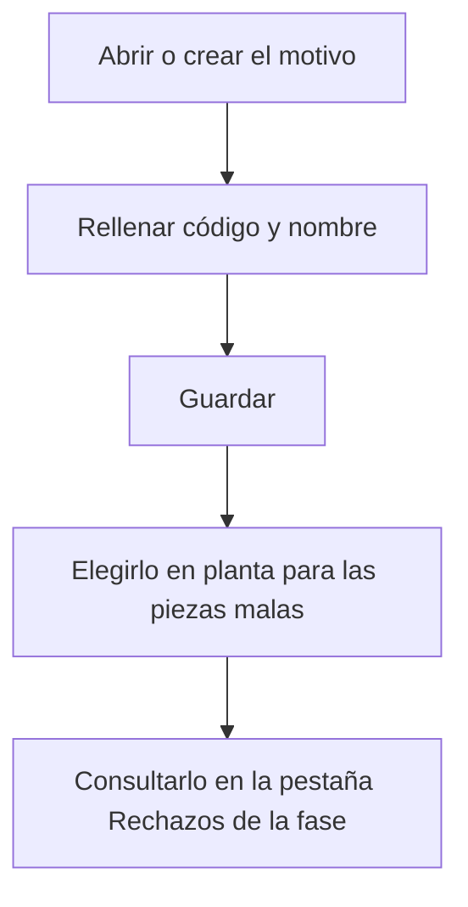

# Motivo de rechazo

## Para qué sirve esta pantalla

Es la ficha de un motivo de rechazo: el código y el nombre con los que el operario identifica por qué una pieza ha salido mala. En planta, el motivo se elige en la sección «Motivos de rechazo» de «Declarar piezas» y de «Finalizar fase». Los rechazos registrados se consultan después en la fase de la orden de fabricación, en la pestaña «Rechazos».

## Acciones disponibles

- Rellenar el «Código», el «Nombre», la «Descripción» y el «Color».
- Marcar o desmarcar «Desactivado» para retirar el motivo de planta sin perder su historial.
- Guardar con «Guardar», en la cabecera. Al guardar, vuelves a la lista.

## Flujo habitual

1. Desde «Motivos de rechazo», pulsa «+» o abre un motivo existente.
2. Escribe un código corto y único, por ejemplo una abreviatura.
3. Escribe el nombre que debe ver el operario en planta.
4. Si hace falta, añade una descripción que explique cuándo debe usarse.
5. Pulsa «Guardar».

## Aspectos importantes

- El «Código» es obligatorio, tiene un máximo de 20 caracteres y no se puede repetir, tampoco con un motivo desactivado.
- El «Nombre» es obligatorio, tiene un máximo de 100 caracteres y es el texto que aparece en el desplegable de planta.
- La «Descripción» y el «Color» son opcionales.
- Un motivo «Desactivado» deja de aparecer en planta, pero los rechazos ya registrados con ese motivo se mantienen.
- En planta, cada motivo solo se puede usar una vez en una misma declaración, y las unidades repartidas entre los motivos deben sumar exactamente las piezas malas declaradas. También se puede declarar sin asignar ningún motivo.
- En planta, la lista de motivos se carga una sola vez: después de crear o desactivar un motivo, hay que recargar la página de planta.

## Errores frecuentes

- Si aparece «Ya existe un motivo de rechazo con el código ...», elige otro código; revisa también los motivos desactivados de la lista.
- Si aparece «El código es obligatorio» o «El código no puede superar los 20 caracteres», revisa el campo «Código».
- Si aparece «El nombre es obligatorio» o «El nombre no puede superar los 100 caracteres», revisa el campo «Nombre».
- Si en planta aparece «El motivo de rechazo ... está desactivado», la página de planta tenía la lista antigua: recárgala y elige un motivo activo.

## Proceso básico

