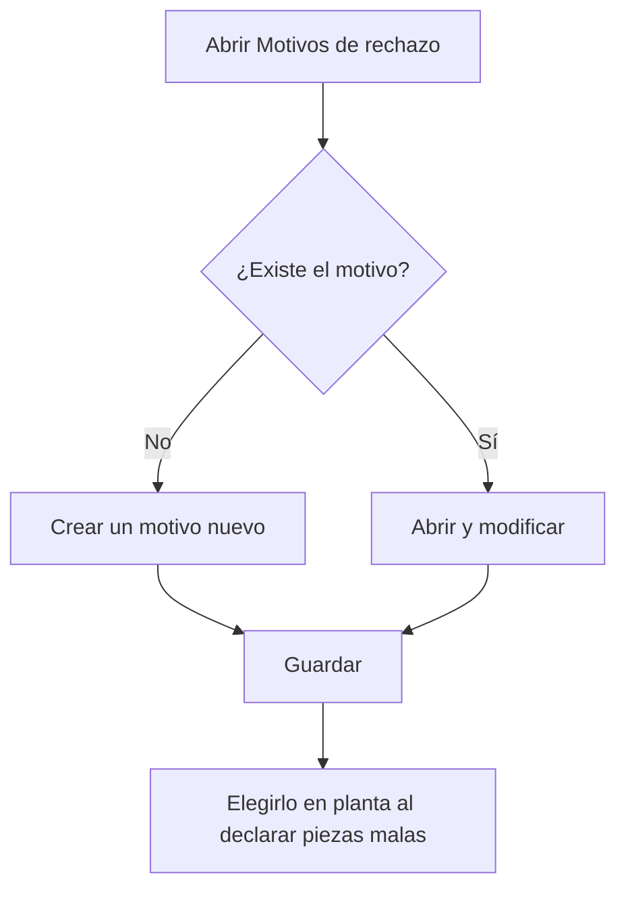

# Motivos de rechazo

## Para qué sirve esta pantalla

Aquí se mantiene el catálogo de motivos de rechazo: las causas por las que una pieza sale mala. En planta, cuando el operario declara piezas malas con «Declarar piezas» o al finalizar la fase, las reparte entre los motivos de este catálogo. Así, cada fase de la orden de fabricación guarda cuántas piezas se han rechazado y por qué motivo.

## Acciones disponibles

- Crear un motivo nuevo con el botón «+» («Crear nuevo») de la cabecera de la tabla.
- Abrir un motivo haciendo clic en la fila para modificarlo.
- Eliminar un motivo con el icono de la papelera de la fila, tras confirmarlo.
- Revisar en la lista el «Código», el «Nombre», la «Descripción» y si el motivo está «Desactivado».

## Flujo habitual

1. Abre «Motivos de rechazo». La lista sale ordenada por código.
2. Comprueba que el motivo que quieres no exista ya.
3. Pulsa «+» para crear uno nuevo, o haz clic en una fila para modificarla.
4. Rellena el código y el nombre en la ficha y pulsa «Guardar». Vuelves a la lista.
5. Cuando un motivo deje de usarse, ábrelo y marca «Desactivado» en lugar de eliminarlo.

## Aspectos importantes

- La lista muestra todos los motivos, también los desactivados. No tiene filtros.
- En planta solo se pueden elegir los motivos que no están desactivados.
- La eliminación es definitiva. Un motivo que ya tiene piezas rechazadas registradas no se puede eliminar: desactívalo.
- Desactivar un motivo no cambia los rechazos ya registrados; solo evita que se elija en declaraciones nuevas.
- En planta, la lista de motivos se carga una sola vez. Después de crear o desactivar un motivo, recarga la página de planta para que el operario vea el cambio.
- Los campos de la ficha y sus reglas se explican en la ayuda de «Motivo de rechazo».

## Errores frecuentes

- Si al eliminar aparece «El motivo de rechazo ... no se puede eliminar porque tiene unidades rechazadas asociadas», el motivo ya se ha usado en planta: márcalo como «Desactivado».
- Si un motivo no aparece en planta al declarar piezas malas, comprueba que no esté «Desactivado» y recarga la página de planta.

## Proceso básico

