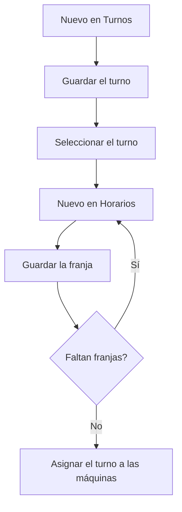

# Gestión de turnos

## Para qué sirve esta pantalla

Define los turnos de trabajo y las franjas horarias de cada turno. A la izquierda está la tabla «Turnos» y a la derecha la tabla «Horarios», con las franjas del turno seleccionado. Cada máquina tiene un turno asignado en el campo «Turno» de «Gestión de máquinas», y la planta muestra en la cabecera el turno actual con su franja horaria.

## Acciones disponibles

- Crear un turno con el botón «Nuevo» de la tabla «Turnos»: se abre el diálogo «Alta de turnos» con «Nombre» y «Deshabilitado».
- Seleccionar un turno haciendo clic en su fila para ver sus franjas en la tabla «Horarios».
- Añadir una franja al turno seleccionado con el botón «Nuevo» de la tabla «Horarios»: se abre el diálogo «Configuració de torns» con «Hora de inicio», «Hora de fin» y «Tiempo productivo».
- Guardar cada diálogo con «Guardar» o cerrarlo con «Cancelar».

## Flujo habitual

1. Pulsa «Nuevo» en la tabla «Turnos», escribe el nombre del turno y pulsa «Guardar».
2. Haz clic en la fila del turno nuevo para seleccionarlo.
3. Pulsa «Nuevo» en la tabla «Horarios».
4. Elige la hora de inicio y la hora de fin, marca o desmarca «Tiempo productivo» y pulsa «Guardar».
5. Repite el paso anterior para cada franja del turno.
6. Asigna el turno a las máquinas en «Gestión de máquinas», en el campo «Turno».

## Aspectos importantes

- El botón «Nuevo» de la tabla «Horarios» solo aparece cuando hay un turno seleccionado.
- Desde esta pantalla solo se pueden crear turnos y franjas: no se pueden modificar ni eliminar. Revisa bien los datos antes de guardar.
- Una franja nueva propone de 00:00 a 23:59 con «Tiempo productivo» marcado: ajústala antes de guardar. Las horas se guardan en horas y minutos.
- El sistema no comprueba que las franjas de un turno no se solapen ni que la hora de fin sea posterior a la de inicio.
- Las franjas se muestran ordenadas por la hora de inicio.
- No puede haber dos turnos con el mismo nombre.
- Cada máquina debe tener un turno: en la ficha de la máquina, el campo «Turno» es obligatorio.

## Errores frecuentes

- Si al crear un turno aparece «La entidad ya existe», ya hay un turno con ese nombre: cámbialo.
- Si no ves el botón «Nuevo» en la tabla «Horarios», selecciona primero un turno en la tabla «Turnos».
- Si la franja que acabas de crear no aparece en la tabla «Horarios», vuelve a hacer clic en el turno para actualizar sus franjas.
- Si una franja se ha guardado con una hora equivocada, no se puede corregir desde esta pantalla: tenlo en cuenta antes de guardar.

## Proceso básico

