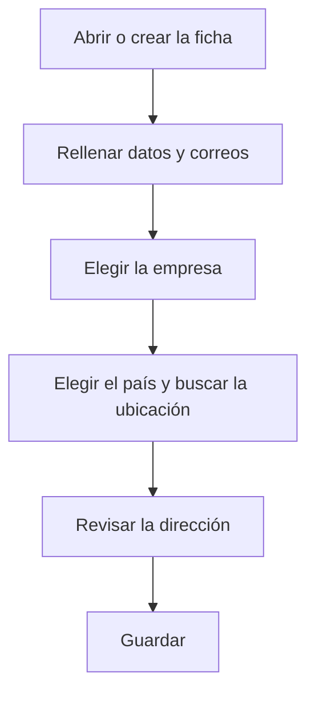

# Centro

## Para qué sirve esta pantalla

Es la ficha de un centro: a qué empresa pertenece, los datos fiscales y de contacto y la dirección. El centro es el segundo nivel de la estructura de planta (empresa -> centro -> área -> máquina). Cuando es el centro predeterminado de la empresa activa, sus datos son los que usan los pedidos, albaranes y facturas de venta, y aparecen en la cabecera de los documentos impresos.

## Acciones disponibles

- Rellenar el «Nombre», la «Descripción», el «CIF» y el «Teléfono».
- Rellenar el «Correo electrónico general», el «Correo electrónico de compras» y el «Correo electrónico de ventas».
- Elegir la «Empresa» a la que pertenece el centro.
- Marcar o desmarcar «Desactivado».
- Elegir el «País» y buscar la dirección en «Buscar ubicación» para rellenarla automáticamente.
- Escribir o corregir a mano la «Dirección», la «Ciudad», la «Provincia» y el «Código postal».
- Desplegar «Coordenadas» para ver o editar la «Latitud» y la «Longitud», y abrir la ubicación con «Ver en el mapa».
- Guardar con «Guardar», en la cabecera. Después de guardar, la aplicación vuelve a la pantalla anterior.

## Flujo habitual

1. Desde «Gestión de centros», pulsa «+» o haz clic en un centro.
2. Rellena el nombre, la descripción, el CIF y el teléfono.
3. Rellena los tres correos y elige la «Empresa».
4. Elige el «País», escribe la dirección en «Buscar ubicación» y elige el resultado correcto.
5. Revisa la dirección, la ciudad, la provincia y el código postal que se han rellenado.
6. Guarda con «Guardar».

## Aspectos importantes

- Son obligatorios el «Nombre», la «Descripción», la «Empresa» y los tres correos, que deben tener un formato de correo válido.
- Para crear pedidos, albaranes y facturas de venta, el centro predeterminado de la empresa activa debe tener «Dirección», «Ciudad», «Provincia», «Código postal», «País» y «CIF». La ficha se puede guardar sin estos datos, pero después el documento de venta se rechaza.
- El «Nombre» admite hasta 50 caracteres, el «CIF» hasta 12 y el «Teléfono» hasta 25. No se puede crear un centro con el nombre de otro que ya existe.
- «Buscar ubicación» solo se activa cuando hay un «País». Elegir un resultado rellena la dirección, la ciudad, la provincia, el código postal y las coordenadas; borrar la búsqueda vacía esos campos.
- Al guardar, si hay dirección, ciudad y país, la aplicación intenta calcular las coordenadas a partir de la dirección y sustituye las que haya.
- «Ver en el mapa» solo aparece cuando el centro tiene coordenadas.
- Las coordenadas del centro sirven de origen para calcular la «Distancia desde la sede (km)» de las direcciones de los clientes y de los proveedores.
- En la cabecera de los documentos impresos aparecen el nombre de la empresa y, del centro, la dirección, el código postal con la ciudad y la provincia, el teléfono, el correo y el CIF. El correo que aparece es el «Correo electrónico de ventas», o el «Correo electrónico general» si el otro está vacío.
- Los datos del centro se leen en el momento de imprimir. Si los cambias, también cambian al volver a imprimir documentos ya creados.
- Para eliminar un centro, hazlo desde la lista; consulta antes su ayuda, porque la eliminación es definitiva.

## Errores frecuentes

- Si aparece «El correo electrónico no es válido» o un aviso parecido en uno de los correos, revisa el formato de los tres campos de correo.
- Si aparece «La empresa es obligatoria» y la lista de empresas está vacía, crea primero la empresa en «Gestión de empresas».
- Si al crear el centro aparece que la sede ya existe, ya hay un centro con ese nombre: elige otro.
- Si al guardar aparece un error, comprueba primero la longitud del «Nombre», del «CIF» y del «Teléfono».
- Si «Buscar ubicación» sale desactivado, elige primero el «País».
- Si un documento de venta se rechaza porque la sede no es válida, completa aquí la dirección, la ciudad, la provincia, el código postal, el país y el CIF.

## Proceso básico

