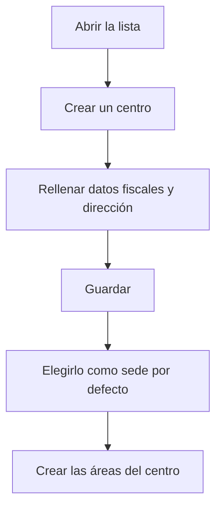

# Gestión de centros

## Para qué sirve esta pantalla

Aquí se gestionan los centros de la empresa, el segundo nivel de la estructura de planta: empresa -> centro -> área -> máquina. Un centro es una ubicación física con sus datos fiscales y de contacto. Esos datos aparecen en la cabecera de los documentos impresos, y las áreas y los almacenes siempre pertenecen a un centro.

## Acciones disponibles

- Crear un centro con el botón «+» («Crear nuevo») de la cabecera de la lista.
- Abrir un centro haciendo clic en la fila (en el móvil, tocando su tarjeta) para modificarlo.
- Eliminar un centro con el icono de la papelera («Eliminar») de la fila, tras confirmarlo.
- Consultar en las columnas el «Nombre», la «Descripción», la «Población», la «Dirección» y si está «Desactivado».

## Flujo habitual

1. Comprueba en «Gestión de empresas» que la empresa ya existe.
2. Abre «Gestión de centros» y pulsa «+».
3. Rellena el nombre, la descripción, la empresa, el CIF, los correos y la dirección, y guarda.
4. En «Gestión de empresas», abre la empresa y elige este centro en «Sede por defecto».
5. Crea las áreas del centro en «Gestión de áreas» y asígnale los almacenes en «Gestión de almacenes».

## Aspectos importantes

- La lista no tiene filtros: muestra todos los centros, también los desactivados, ordenados por nombre.
- Los campos obligatorios y los datos que necesitan los documentos de venta se explican en la ayuda de la ficha del centro.
- El centro predeterminado de la empresa activa es el que se asigna a los pedidos, albaranes y facturas de venta nuevos.
- Eliminar un centro es definitivo y puede arrastrar los datos que dependen de él, como sus áreas y máquinas, los almacenes o los albaranes. Si el centro ya se ha usado en documentos, la eliminación puede fallar. Si ya no lo usas, márcalo como «Desactivado» en lugar de eliminarlo.
- Si eliminas el centro predeterminado de una empresa, la empresa se queda sin centro predeterminado y no se pueden crear documentos de venta hasta que elijas otro.

## Errores frecuentes

- Si al eliminar un centro aparece un error, el centro ya está en uso: desactívalo en lugar de eliminarlo.
- Si al crear un pedido, un albarán o una factura de venta aparece que la sede no es válida, abre el centro predeterminado de la empresa y completa la dirección, la ciudad, la provincia, el código postal, el país y el CIF.
- Si un centro no aparece para elegirlo como «Sede por defecto» de una empresa, ábrelo y comprueba que en el campo «Empresa» esté esa empresa.

## Proceso básico

