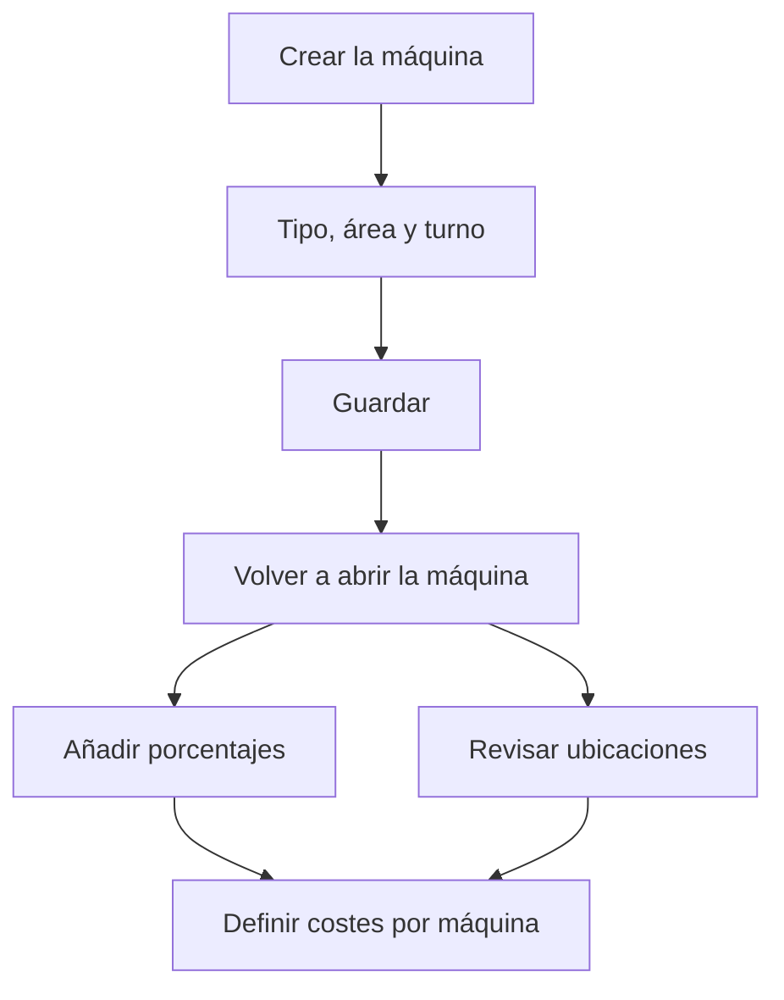

# Máquina

## Para qué sirve esta pantalla

Es la ficha de una máquina. Define cómo se identifica, a qué tipo, área y turno pertenece y qué margen de beneficio se le aplica. Las pestañas permiten añadir una imagen, una lista de porcentajes de beneficio y las ubicaciones de almacén donde se deja el material para trabajar en ella. El título muestra «Alta de máquina» al crearla y «Máquina: » seguido del nombre al editarla.

## Acciones disponibles

- Rellenar el «Nombre», la «Descripción», el «Tipo», el «Área» y el «Turno», que son obligatorios, y si hace falta el «Margen de beneficio».
- Marcar «Desactivado» para retirar la máquina de la planta sin borrarla.
- Guardar con «Guardar», en la cabecera. Al guardar, vuelves a la lista.
- Pestaña «Imagen»: subir un archivo con el botón de subida, y verlo, descargarlo o eliminarlo. Solo admite uno.
- Pestaña «Porcentajes»: añadir un porcentaje de beneficio con «+» (diálogo «Nuevo porcentaje de beneficio») y eliminarlo con la «X» de la fila.
- Pestaña «Ubicaciones»: vincular una ubicación de almacén con «+» (diálogo «Vincular ubicación») y desvincularla con la «X» de la fila.

## Flujo habitual

1. Desde «Gestión de máquinas», pulsa «+».
2. Rellena el nombre, la descripción, el tipo, el área y el turno, y pulsa «Guardar».
3. Vuelve a abrir la máquina desde la lista.
4. En «Porcentajes», añade los márgenes de beneficio que se pueden aplicar a esta máquina.
5. En «Ubicaciones», comprueba la ubicación de aprovisionamiento y vincula otras si hace falta.
6. Define el precio por hora de cada estado de la máquina en «Costes por máquina».

## Aspectos importantes

- Al crear la máquina, el sistema crea automáticamente una ubicación de aprovisionamiento llamada «APR-» seguido del nombre de la máquina en un almacén activo, y la vincula en la pestaña «Ubicaciones». Si no hay ningún almacén activo, no se crea ninguna.
- Añade porcentajes y ubicaciones después de haber guardado la máquina nueva: las pestañas se ven desde el principio, pero necesitan que la máquina ya exista.
- Las ubicaciones vinculadas se usan en la pantalla de la máquina en planta: un material se considera aprovisionado cuando tiene existencias en alguna de estas ubicaciones, y el material que se mueve hacia la máquina va a la ubicación vinculada. Desvincular una ubicación no la borra del almacén.
- Marcar «Desactivado» retira la máquina de la planta y de la lista de «Máquina preferida» de las fases, y también desactiva su ubicación de aprovisionamiento. Desmarcarlo la vuelve a activar.
- En planta solo aparecen las máquinas activas de áreas que tienen marcado «Visible en planta».
- Margen de beneficio en una fase de una ruta de fabricación: al elegir esta máquina como «Máquina preferida», si la pestaña «Porcentajes» tiene valores, el margen de la fase se elige de esa lista. Si no tiene, se propone el «Margen de beneficio» de la máquina si es mayor que 0 y, si no, el del tipo de máquina.
- En una fase de una orden de fabricación se propone el «Margen de beneficio» de la máquina si es mayor que 0 y, si no, el del tipo. Cambiar los márgenes aquí no modifica las fases ya guardadas.
- Los porcentajes deben ser mayores que 0, como máximo 100, y no se pueden repetir.
- El precio por hora de la máquina no se define aquí, sino en «Costes por máquina», un precio para cada estado de máquina.

## Errores frecuentes

- Si aparece «El tipo es obligatorio», «El área es obligatoria» o «El turno es obligatorio», elige un valor en cada desplegable. Si un desplegable sale vacío, abre la máquina desde «Gestión de máquinas» para que se carguen las opciones.
- Si aparece «Centro de trabajo ... existente», ya hay una máquina con ese nombre.
- Si al guardar un nombre largo aparece un error, acórtalo: el nombre de la máquina admite como máximo 50 caracteres.
- Si aparece «El porcentaje ...% ya existe» o «Esta ubicación ya está asignada a esta máquina», el valor ya está en la lista.
- Si en planta, al mover material a la máquina, aparece «No se ha encontrado la ubicación de aprovisionamiento para el centro de trabajo», vincula una ubicación activa en la pestaña «Ubicaciones».

## Proceso básico

