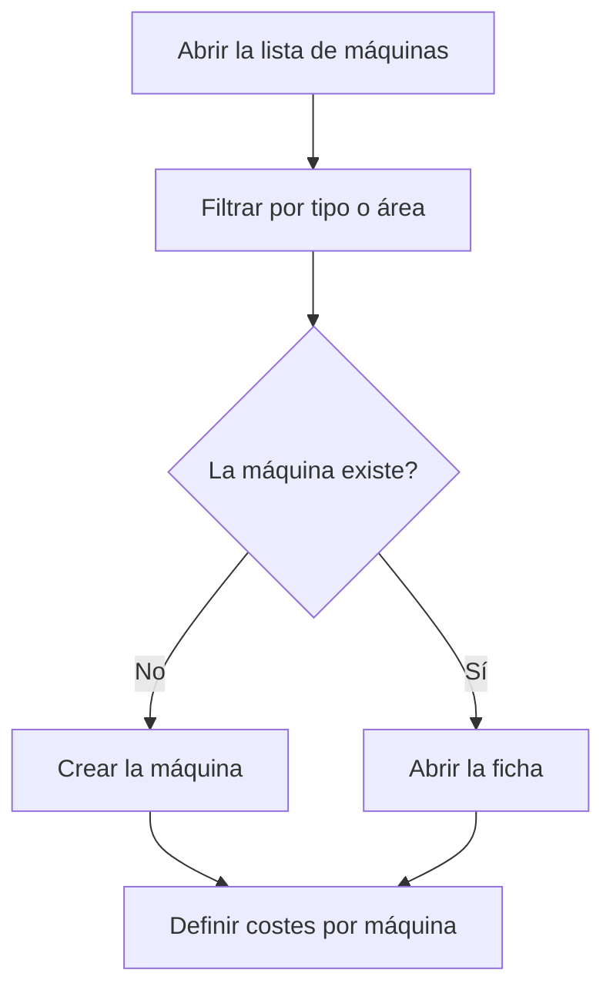

# Gestión de máquinas

## Para qué sirve esta pantalla

Lista todas las máquinas de la planta con su tipo y su área. Desde aquí se localiza una máquina para abrir su ficha o se da de alta una nueva. Las máquinas son la base del trabajo en planta y del cálculo de costes: tipo de máquina -> máquina -> costes por máquina -> fases de las rutas y órdenes de fabricación -> trabajo en planta.

## Acciones disponibles

- Filtrar la lista por «Tipo» y por «Área».
- Vaciar los filtros con el icono «Limpiar filtros».
- Crear una máquina con el botón «+» («Crear nuevo»).
- Abrir una máquina haciendo clic en su fila.
- Eliminar una máquina con el icono de la papelera («Eliminar»), tras confirmarlo.
- Consultar el «Nombre», la «Descripción», el «Tipo», el «Área» y si está «Desactivado».

## Flujo habitual

1. Elige un tipo o un área en los filtros para reducir la lista.
2. Haz clic en la máquina para abrir su ficha, o pulsa «+» para crear una.
3. Rellena los datos de la máquina y guárdala.
4. Define el precio por hora de cada estado de la máquina en «Costes por máquina».
5. Cuando una máquina deje de trabajar, ábrela y márcala como «Desactivado» en lugar de eliminarla.

## Aspectos importantes

- Los filtros se aplican al instante y se recuerdan: cuando vuelvas a la pantalla, encontrarás los últimos filtros que usaste.
- Los filtros solo ofrecen tipos y áreas activos. En la tabla, la columna «Tipo» o «Área» sale vacía si la máquina tiene asignado un tipo o un área desactivados.
- La lista incluye las máquinas desactivadas. Una máquina desactivada no aparece en planta ni se puede elegir como «Máquina preferida» en las fases.
- En planta solo aparecen las máquinas activas de áreas que tienen marcado «Visible en planta» en «Gestión de áreas».
- La eliminación es definitiva y también borra los datos que dependen de la máquina, como los costes por estado, los porcentajes de beneficio y la ubicación de aprovisionamiento que se le creó. Si la máquina ya ha trabajado, desactívala en lugar de eliminarla.
- Los campos y las pestañas de la ficha se explican en la ayuda de la pantalla «Máquina».

## Errores frecuentes

- Si no puedes eliminar una máquina, comprueba si es la «Máquina preferida» de alguna fase de una ruta o de una orden de fabricación; en ese caso, desactívala.
- Si no encuentras una máquina, revisa los filtros «Tipo» y «Área» y vacíalos con «Limpiar filtros».
- Si una máquina no aparece en planta, comprueba que no esté desactivada y que su área tenga marcado «Visible en planta».

## Proceso básico

