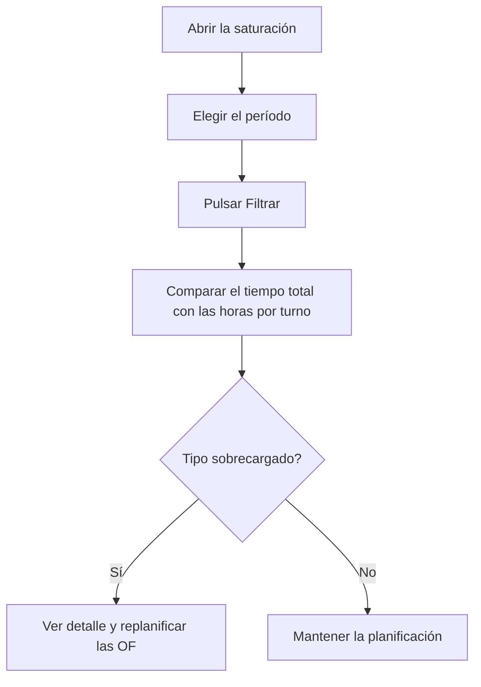

# Saturación de los centros de trabajo

## Para qué sirve esta pantalla

Muestra cuánto trabajo hay planificado para cada tipo de centro de trabajo en un período: suma el tiempo estimado de las fases de las órdenes de fabricación (OF) previstas para esas fechas. Sirve para detectar qué tipos de máquina van sobrecargados antes de lanzar la producción y comparar la carga con las horas disponibles a uno, dos o tres turnos.

## Acciones disponibles

- Elegir el «Período» en el filtro y pulsar el botón «Filtrar» (icono del embudo) para calcular la carga.
- Limpiar el filtro con el botón de limpiar filtros: vacía el período y el resultado.
- Ordenar la tabla por «Tipo de centro de trabajo» o por «Tiempo total estimado».
- Abrir el detalle de un tipo con «Ver detalle»: lista las fases que forman esa carga.
- En el detalle, ordenar por «Orden de trabajo», «Prioridad», «Fecha planificada», «Código de fase», «Cantidad» o «Tiempo estimado».

## Flujo habitual

1. Abre la pantalla: el período se fija solo en el ejercicio del año en curso y la tabla se carga.
2. Cambia el «Período» a las semanas o el mes que quieres planificar y pulsa «Filtrar».
3. Lee el resumen de días laborables y horas por turno que aparece junto a los botones del filtro.
4. Mira los tipos con más «Tiempo total estimado» (la tabla ya sale ordenada de mayor a menor).
5. Pulsa «Ver detalle» para ver qué OF y fases aportan carga, ordenadas por prioridad y fecha planificada.
6. Si un tipo va sobrecargado, replanifica o cambia la prioridad de las OF desde las pantallas de órdenes de fabricación.

## Aspectos importantes

- **Qué OF se cuentan**: solo las OF no desactivadas con la fecha planificada dentro del período y con un estado que tenga la etiqueta «Available» en «Ciclos de vida». Las OF en otros estados (por ejemplo, cerradas o sin esa etiqueta) no cargan ninguna máquina.
- **Qué fases se cuentan**: todas las fases de esas OF que tienen un tipo de centro de trabajo asignado. Las fases sin tipo no aparecen.
- **«Tiempo estimado» de una fase**: suma de los tiempos estimados de sus pasos. Si un paso es por tiempo de ciclo, su tiempo se multiplica por la cantidad planificada de la OF; si no, cuenta una sola vez.
- **«Tiempo total estimado»**: suma del tiempo estimado de todas las fases del tipo. Se muestra en horas y minutos.
- La carga es el tiempo estimado completo de cada fase: no se resta lo ya fabricado ni se mira el estado de la fase.
- Junto al nombre del tipo aparece entre paréntesis el número de centros de trabajo de ese tipo. Para comparar con la capacidad, multiplica las horas por turno por el número de centros.
- El resumen de capacidad cuenta como laborables todos los días de lunes a viernes del período y 8 horas por turno. No tiene en cuenta festivos, calendarios ni los turnos reales de cada máquina.
- La pantalla solo consulta: no modifica ninguna OF ni ninguna fase.

## Errores frecuentes

- Si aparece «Filtro no válido» con «Selecciona un período válido», elige tanto la fecha de inicio como la de fin antes de pulsar «Filtrar».
- Si al abrir la pantalla la tabla sale vacía y sin período, no hay ningún ejercicio que se llame como el año en curso (por ejemplo, «2026»): elige el período a mano.
- Si la tabla sale vacía con un período elegido, comprueba que haya OF con fecha planificada en esas fechas y que su estado tenga la etiqueta «Available» en «Ciclos de vida».
- Si una OF que esperabas no aparece, revisa su fecha planificada, su estado y que sus fases tengan un tipo de centro de trabajo.
- Si una fase sale con tiempo 0, sus pasos no tienen tiempo estimado o la fase no tiene pasos.
- Si el tiempo de una fase parece demasiado alto, comprueba si algún paso está marcado como tiempo de ciclo: entonces se multiplica por toda la cantidad planificada.

## Proceso básico

