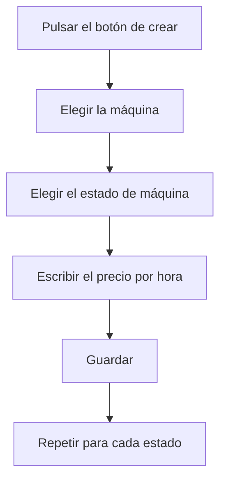

# Coste por máquina

## Para qué sirve esta pantalla

Es la ficha de un precio por hora: qué máquina, en qué estado de máquina y cuánto cuesta cada hora de trabajo en ese estado. El título muestra «Alta de coste por máquina» al crearlo y «Editar coste por máquina» al editarlo. Cómo se usan estos precios en las rutas de fabricación y en planta se explica en la ayuda de «Costes por máquina».

## Acciones disponibles

- Elegir la «Máquina», que es obligatoria.
- Elegir el «Estado de máquina», que es obligatorio.
- Escribir el «Precio por hora» en euros, que es obligatorio.
- Marcar o desmarcar «Desactivado».
- Guardar con «Guardar», en la cabecera. Al guardar, vuelves a la lista.

## Flujo habitual

1. Desde «Costes por máquina», pulsa «+».
2. Elige la máquina.
3. Elige el estado de máquina.
4. Escribe el precio por hora.
5. Pulsa «Guardar».
6. Repítelo para cada estado en el que trabaja la máquina.

## Aspectos importantes

- El precio es por hora: los tiempos de planta y de las rutas de fabricación se cuentan en minutos y se convierten a horas para aplicarlo.
- Cada máquina solo puede tener un precio por estado de máquina. No se puede crear ni guardar una combinación que ya existe.
- El desplegable «Estado de máquina» muestra todos los estados definidos en «Gestión de estados de máquina», también los desactivados.
- El precio puede ser 0; estas combinaciones se localizan en la lista con el filtro «Coste 0».
- Cambiar el precio no recalcula el coste ya registrado en planta: solo afecta a los cambios de estado posteriores y a los cálculos de costes de las rutas que se hagan a partir de ahora.
- Marcar «Desactivado» no impide que el precio se siga aplicando en los cálculos.

## Errores frecuentes

- Si aparece «La máquina es obligatoria», «El estado de máquina es obligatorio» o «El coste es obligatorio», rellena el campo indicado antes de guardar.
- Si aparece «La entidad ya existe», esta máquina ya tiene precio para ese estado: búscala en la lista con el filtro «Máquina» y edítala.
- Si el desplegable «Máquina» sale vacío, abre la ficha desde «Costes por máquina» para que se carguen las máquinas.

## Proceso básico

