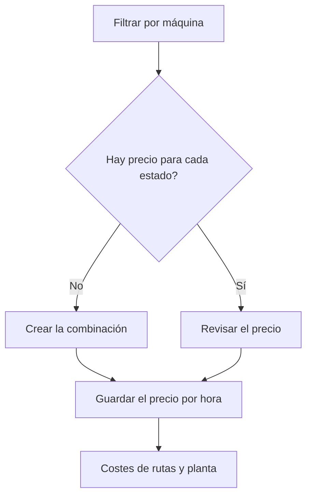

# Costes por máquina

## Para qué sirve esta pantalla

Lista el precio por hora de cada máquina en cada estado de máquina. Estos precios alimentan el coste de máquina estimado de las rutas de fabricación y el coste real que se registra cuando la máquina trabaja en planta: máquina y estado de máquina -> precio por hora -> coste de la ruta de fabricación y tickets de producción -> «Panel de costes de producción».

## Acciones disponibles

- Filtrar la lista por «Máquina».
- Marcar el filtro «Coste 0» para ver solo las combinaciones con precio 0.
- Vaciar los filtros con el icono «Limpiar filtros».
- Crear una combinación nueva con el botón «+» («Crear nuevo»).
- Abrir una fila para cambiar su precio.
- Eliminar una combinación con el icono de la papelera («Eliminar»), tras confirmarlo.
- Consultar la «Máquina», el «Estado de máquina», el «Coste» y si está «Desactivada».

## Flujo habitual

1. Elige la máquina en el filtro «Máquina».
2. Comprueba que haya una fila para cada estado de máquina en el que trabaja.
3. Marca «Coste 0» para encontrar precios pendientes de rellenar.
4. Pulsa «+» para añadir la combinación que falte, o abre una fila para cambiar su precio.
5. Guarda y vuelve a la lista.

## Aspectos importantes

- Cada combinación de máquina y estado de máquina solo puede tener un precio. La lista sale ordenada por máquina y los filtros se recuerdan cuando vuelves.
- Rutas de fabricación: el coste de máquina estimado se calcula con el tiempo de cada paso convertido a horas, multiplicado por el precio de la «Máquina preferida» de la fase en el estado de máquina del paso.
- En una fase de una ruta de fabricación no se puede añadir ni modificar un paso si alguna máquina del tipo de la fase, también las desactivadas, no tiene precio para el estado de máquina del paso.
- Planta: cada vez que la máquina cambia de estado se guarda el precio por hora vigente en ese momento. Si no hay precio para esa combinación, se guarda 0.
- Al finalizar una fase, los tickets de producción toman el precio medio ponderado por el tiempo. De estos tickets salen el coste de máquina de la orden de fabricación y los costes del «Panel de costes de producción».
- Cambiar un precio no recalcula el coste ya registrado: solo afecta a los cambios de estado posteriores y a los cálculos de costes de las rutas que se hagan a partir de ahora.
- La marca «Desactivada» no impide que el precio se siga aplicando en los cálculos. Para dejar de aplicarlo, cambia su valor.
- La eliminación es definitiva. Después, los cambios de estado de esa combinación se registran con coste 0 y el cálculo de costes de las rutas que la necesitan no se puede completar.

## Errores frecuentes

- Si al añadir un paso a una fase de una ruta aparece «No se ha encontrado el costo del centro de trabajo», falta el precio de ese estado de máquina en alguna máquina del tipo de la fase: filtra por cada máquina del tipo y añade la combinación.
- Si el cálculo de costes de una ruta falla con «No se ha encontrado la combinación de centro de trabajo y estado de máquina», comprueba que cada fase tenga «Máquina preferida» y que esa máquina tenga precio para todos los estados de los pasos.
- Si los costes de máquina en planta salen a 0, comprueba con el filtro «Máquina» que la combinación exista y con «Coste 0» que no tenga precio 0.

## Proceso básico

