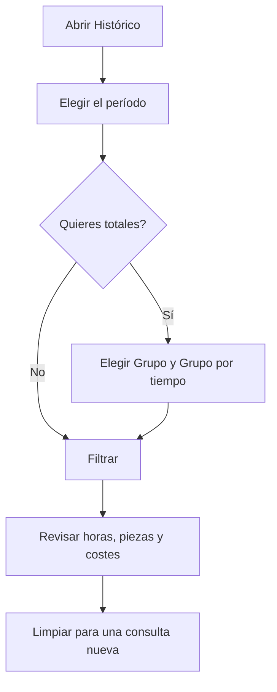

# Histórico

## Para qué sirve esta pantalla

Consulta la actividad registrada en las máquinas (centros de trabajo) durante un período. Cada fila es un tramo de tiempo de una máquina: en qué estado estaba, qué operario estaba fichado, qué orden de fabricación y fase tenía cargada, cuántas piezas buenas y malas se declararon, cuántas horas duró y cuánto costó. Los datos se generan solos cuando los operarios trabajan en planta; esta pantalla solo sirve para consultarlos, agruparlos y comparar el coste real con el estimado de la orden de fabricación.

## Acciones disponibles

- Elegir el «Período» en el calendario del filtro: primer día y último día. Es obligatorio.
- Agrupar los resultados con «Grupo»: «Operario», «Centro de trabajo», «Orden de trabajo» o «Ninguno».
- Agrupar por períodos con «Grupo por tiempo»: «Día», «Semana», «Mes», «Año» o «Ninguno».
- Consultar con «Filtrar» y vaciar el filtro y los resultados con «Limpiar».
- Ordenar por las columnas «Centro de trabajo», «Operario», «Inicio», «Fin», «Orden de trabajo» y «Fase», incluso por varias a la vez.
- Pasar página: se muestran 25 filas por página.

## Flujo habitual

1. Abre «Histórico».
2. Elige el período en el calendario.
3. Si quieres totales, elige un grupo, por ejemplo «Operario», y un grupo por tiempo, por ejemplo «Semana».
4. Pulsa «Filtrar».
5. Revisa las horas, las cantidades y los costes, y ordena por la columna que te interese.
6. Pulsa «Limpiar» para empezar una consulta nueva.

## Aspectos importantes

- Sin período no se consulta nada: aparece el aviso «Filtro no válido».
- Un tramo nuevo empieza cada vez que cambia el estado de la máquina, un operario entra o sale, se carga una fase o cambia el turno.
- Solo aparecen los tramos ya terminados que empiezan y terminan dentro del período elegido. El tramo en curso de una máquina no aparece hasta que se cierra.
- «Horas» es la duración del tramo. Si el operario estaba fichado en varias máquinas a la vez, el tiempo se reparte entre ellas.
- «Coste operario» son las horas del tramo por el coste/hora del tipo de operario, guardado en el momento de fichar. «Coste del centro» son las horas por el coste/hora de la máquina en ese estado, según «Costes por máquina». «Coste total» es la suma de ambos.
- Los tramos sin ningún operario fichado tienen la columna «Operario» vacía y no tienen coste de operario.
- «Cantidad prevista», «Coste del operario estimado (por OF)» y «Coste del centro estimado (por OF)» son de toda la orden de fabricación, no del tramo: se repiten en cada fila de la misma orden y no deben sumarse.
- La columna «Orden de trabajo» muestra el código de la orden de fabricación.
- Al agrupar, las horas, las cantidades y los costes reales se suman, e «Inicio» y «Fin» muestran el primer y el último momento del grupo. Las columnas que mezclan valores distintos muestran «Various», y el estado y la fase quedan vacíos. Los valores estimados por OF de una fila agrupada son los de la primera fila del grupo.

## Errores frecuentes

- Si aparece «Filtro no válido» con «Seleccione un período», elige en el calendario tanto el primer como el último día.
- Si faltan tramos de los últimos momentos del período, amplía el período un día más y recuerda que los tramos en curso no aparecen.
- Si el «Coste operario» sale a cero con un operario fichado, revisa el «Coste/hora» de su tipo en «Gestión de tipos de operario». El cambio solo se aplica a los fichajes nuevos.
- Si el «Coste del centro» sale a cero, revisa en «Costes por máquina» que la máquina tiene coste para ese estado.

## Proceso básico

